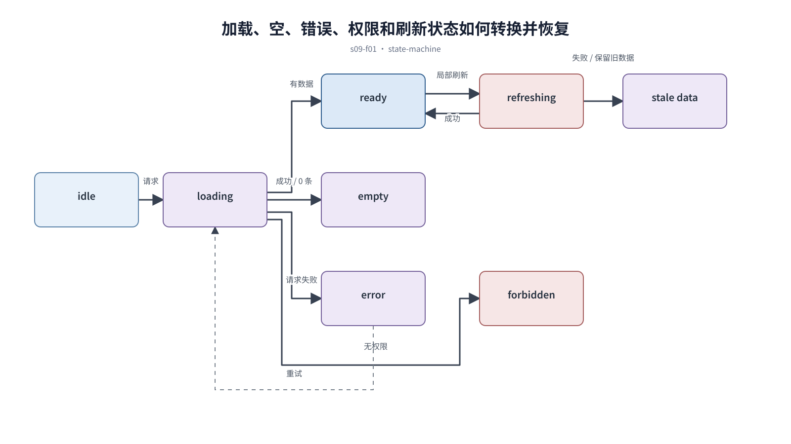

## 前置知识与学习目标

**前置知识：** 理解输入、提交和异步请求的基本过程。

**本篇唯一核心问题：** 怎样把加载、空、错误、权限和成功反馈建模为可恢复的界面状态机？

读完后，你应该能够：能枚举状态、触发事件、可用操作和恢复路径，避免只设计正常态。本篇沿用“跨端客户工单管理 SaaS”，核心对象统一为 `ticket`、`customer`、`assignee`、`status`、`priority` 与 `permission`。

上一章已经解决“怎样把表单、筛选、搜索和弹窗组成低错误、可撤销的操作链”的问题；本篇把它作为输入，不再重复完整解释。

## 从真实问题出发

工单列表请求超时后只显示空白，用户无法判断是没有数据、没有权限还是网络失败。

先不要急着选择组件或颜色。应先写清楚当前用户、对象、触发条件、成功结果和失败后仍需保留的上下文，再判断界面应该表达什么。

## 核心机制

状态由数据、权限和请求阶段共同决定。loading 表示结果未知，empty 表示成功返回但集合为空，error 表示目标未达成，forbidden 表示身份有效但无权访问；每种状态都要给出下一步。

<!-- series-figure:s09-f01 -->



<!-- series-figure:end -->

### 1. 初次加载与局部刷新分开表达，刷新不应清空仍可使用的旧数据

初次加载与局部刷新分开表达，刷新不应清空仍可使用的旧数据。它先固定主路径和优先级，后续布局不得反过来改变业务判断。验收时要用真实任务观察用户能否找到下一步。

### 2. 空状态说明为什么为空，并提供创建、调整筛选或返回入口

空状态说明为什么为空，并提供创建、调整筛选或返回入口。它把抽象原则转换成可见结构。验收时应检查对象、标签、状态和操作是否逐项对应，而不是凭整体观感打分。

### 3. 错误信息区分用户可修复、可重试和必须联系管理员的情况

错误信息区分用户可修复、可重试和必须联系管理员的情况。它负责异常与边界，必须使用空数据、慢请求、权限差异或冲突数据复测，不能只验证理想状态。

### 4. 权限状态不得泄露敏感对象，但应说明申请权限或返回安全位置的方法

权限状态不得泄露敏感对象，但应说明申请权限或返回安全位置的方法。它防止局部页面自行发明规则。跨端、跨主题或跨角色检查时，语义保持一致，呈现方式才允许重组。

## 关键角色、数据与状态

| 项目     | 在本篇中的含义                                                                       |
| -------- | ------------------------------------------------------------------------------------ | ----- | ----- | ---------- |
| 输入     | `idle → loading → ready                                                              | empty | error | forbidden` |
| 业务对象 | `ticket` 是工单，`customer` 是客户，`assignee` 是当前负责人                          |
| 约束     | `permission` 决定可执行动作；`priority` 影响排序，不直接替代业务状态                 |
| 状态主线 | `draft → submitted → processing → resolved → closed`，只有满足权限和前置条件才能转换 |
| 输出     | 能枚举状态、触发事件、可用操作和恢复路径，避免只设计正常态。                         |

`idle → loading → ready|empty|error|forbidden`；`error → loading` 由重试触发，`ready → refreshing → ready|error-with-stale-data` 保留旧数据。

## 最小实践：贯穿工单案例

主管刷新工单列表失败时继续展示上次数据并标记更新时间；首次访问且 403 时显示所需角色和申请入口，不渲染敏感字段。

执行时使用下面的决策记录，避免示例只有结果而没有中间状态：

```text
输入：角色、ticket、当前 status、permission、终端与网络状态
检查：核心任务、业务规则、可见反馈、失败恢复、跨端差异
中间状态：记录用户动作、系统判断、状态变化和仍被保留的数据
输出：可验证的界面方案、实现约束与验收证据
失败边界：权限不足、空数据、超时、冲突、长文案和窄屏
```

这里的 `status` 表示业务状态；请求的 loading/error 是界面请求状态，两者不能混为一个字段。示例中的数值与规则只用于教学，接入真实项目时必须由产品规则、接口契约和数据字典确认。

## 常见误区

- **把请求失败显示成空数据：** 这会让界面结论失去可验证依据；应回到输入、状态和恢复路径重新检查。
- **每次刷新都显示整页骨架：** 这会让界面结论失去可验证依据；应回到输入、状态和恢复路径重新检查。
- **成功 toast 替代页面中的持久状态更新：** 这会让界面结论失去可验证依据；应回到输入、状态和恢复路径重新检查。

## 适用边界与不适用场景

- 极短的本地同步操作不需要复杂加载态，但仍要有结果反馈。
- 后台任务应展示队列、进度和取消能力，不能用无限 spinner 代替。

如果当前任务没有多对象关系、状态变化或失败恢复，不要为了套用本章而制造额外组件和流程。复杂度必须来自真实认知问题。

## 自检题

1. 用一句话说明：怎样把加载、空、错误、权限和成功反馈建模为可恢复的界面状态机？
2. 在工单案例中，输入、中间状态和输出分别是什么？
3. 本章方法在哪些场景不应直接套用？

<details>
<summary>查看答案</summary>

1. 状态由数据、权限和请求阶段共同决定。loading 表示结果未知，empty 表示成功返回但集合为空，error 表示目标未达成，forbidden 表示身份有效但无权访问；每种状态都要给出下一步。
2. `idle → loading → ready|empty|error|forbidden`；`error → loading` 由重试触发，`ready → refreshing → ready|error-with-stale-data` 保留旧数据。
3. 极短的本地同步操作不需要复杂加载态，但仍要有结果反馈。后台任务应展示队列、进度和取消能力，不能用无限 spinner 代替。

</details>

## 本篇总结

能枚举状态、触发事件、可用操作和恢复路径，避免只设计正常态。真正的完成标准不是“看起来合理”，而是每条规则都能追溯到任务、数据、状态或规范，并能通过边界场景验证。

## 下一篇衔接

下一篇将解决“怎样让数据表格支持比较、定位和批量行动，而不是堆满字段”。本篇输出的决策、约束和案例状态将作为它的直接输入。

## 资料来源

- [WAI-ARIA APG：Alert](https://www.w3.org/WAI/ARIA/apg/patterns/alert/)
- [WAI-ARIA APG：Feed](https://www.w3.org/WAI/ARIA/apg/patterns/feed/)
- [Nielsen Norman Group：Visibility of System Status](https://www.nngroup.com/articles/visibility-system-status/)
