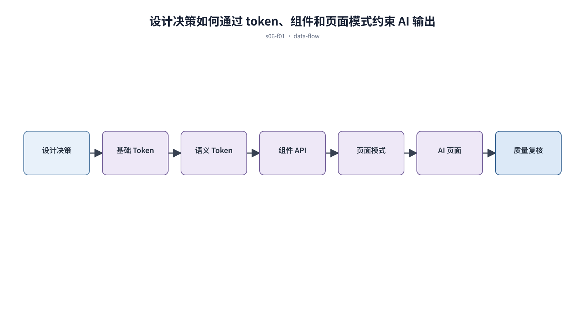

## 前置知识与学习目标

**前置知识：** 已有排版、间距和颜色规则，理解基础组件与业务组件的区别。

**本篇唯一核心问题：** 怎样把视觉决策编码为 Design Tokens 和受约束组件，使 AI 输出不再漂移？

读完后，你应该能够：能建立基础、语义、组件三层 token，并让组件 API 和页面模式消费这些约束。本篇沿用“跨端客户工单管理 SaaS”，核心对象统一为 `ticket`、`customer`、`assignee`、`status`、`priority` 与 `permission`。

上一章已经解决“怎样让颜色承担语义而不是制造视觉噪声”的问题；本篇把它作为输入，不再重复完整解释。

## 从真实问题出发

同一产品的 AI 生成页每次使用不同蓝色、圆角和按钮高度，评审只能反复手工修正。

先不要急着选择组件或颜色。应先写清楚当前用户、对象、触发条件、成功结果和失败后仍需保留的上下文，再判断界面应该表达什么。

## 核心机制

基础 token 保存原子值，语义 token 描述用途，组件 token 处理局部变体。组件 API 暴露业务需要的状态，页面模式规定组件如何协作；AI 只能在这些可用积木中组合。

<!-- series-figure:s06-f01 -->



<!-- series-figure:end -->

### 1. 业务代码优先引用语义 token，不直接引用 `blue-600` 等原子值

业务代码优先引用语义 token，不直接引用 `blue-600` 等原子值。它先固定主路径和优先级，后续布局不得反过来改变业务判断。验收时要用真实任务观察用户能否找到下一步。

### 2. 组件必须声明 default、hover、focus、disabled、loading 和 error 等可达状态

组件必须声明 default、hover、focus、disabled、loading 和 error 等可达状态。它把抽象原则转换成可见结构。验收时应检查对象、标签、状态和操作是否逐项对应，而不是凭整体观感打分。

### 3. 页面模式描述对象、区域和交互顺序，不把具体业务文案写死

页面模式描述对象、区域和交互顺序，不把具体业务文案写死。它负责异常与边界，必须使用空数据、慢请求、权限差异或冲突数据复测，不能只验证理想状态。

### 4. token 变更经过视觉回归和可访问性检查，再进入所有主题与终端

token 变更经过视觉回归和可访问性检查，再进入所有主题与终端。它防止局部页面自行发明规则。跨端、跨主题或跨角色检查时，语义保持一致，呈现方式才允许重组。

## 关键角色、数据与状态

| 项目     | 在本篇中的含义                                                                       |
| -------- | ------------------------------------------------------------------------------------ |
| 输入     | 输入是设计决策                                                                       |
| 业务对象 | `ticket` 是工单，`customer` 是客户，`assignee` 是当前负责人                          |
| 约束     | `permission` 决定可执行动作；`priority` 影响排序，不直接替代业务状态                 |
| 状态主线 | `draft → submitted → processing → resolved → closed`，只有满足权限和前置条件才能转换 |
| 输出     | 是设计工具与代码可共同消费的约束。                                                   |

输入是设计决策；中间状态是 DTCG token、组件变体和页面模式；输出是设计工具与代码可共同消费的约束。

## 最小实践：贯穿工单案例

把 `color.action.primary` 映射到按钮背景，把 `status.processing` 映射到状态标签；AI 生成工单列表时只能使用 `PageHeader`、`FilterBar`、`DataTable` 和 `StatusTag`。

执行时使用下面的决策记录，避免示例只有结果而没有中间状态：

```text
输入：角色、ticket、当前 status、permission、终端与网络状态
检查：核心任务、业务规则、可见反馈、失败恢复、跨端差异
中间状态：记录用户动作、系统判断、状态变化和仍被保留的数据
输出：可验证的界面方案、实现约束与验收证据
失败边界：权限不足、空数据、超时、冲突、长文案和窄屏
```

这里的 `status` 表示业务状态；请求的 loading/error 是界面请求状态，两者不能混为一个字段。示例中的数值与规则只用于教学，接入真实项目时必须由产品规则、接口契约和数据字典确认。

## 常见误区

- **把所有 CSS 变量都叫 Design Token：** 这会让界面结论失去可验证依据；应回到输入、状态和恢复路径重新检查。
- **组件允许任意颜色和间距覆盖：** 这会让界面结论失去可验证依据；应回到输入、状态和恢复路径重新检查。
- **只建设组件库，不沉淀页面模式：** 这会让界面结论失去可验证依据；应回到输入、状态和恢复路径重新检查。

## 适用边界与不适用场景

- 一次性原型可以缩小 token 范围，但要保留语义命名以便验证后迁移。
- 跨品牌平台需要主题层，不能在单个组件里堆品牌条件。

如果当前任务没有多对象关系、状态变化或失败恢复，不要为了套用本章而制造额外组件和流程。复杂度必须来自真实认知问题。

## 自检题

1. 用一句话说明：怎样把视觉决策编码为 Design Tokens 和受约束组件，使 AI 输出不再漂移？
2. 在工单案例中，输入、中间状态和输出分别是什么？
3. 本章方法在哪些场景不应直接套用？

<details>
<summary>查看答案</summary>

1. 基础 token 保存原子值，语义 token 描述用途，组件 token 处理局部变体。组件 API 暴露业务需要的状态，页面模式规定组件如何协作；AI 只能在这些可用积木中组合。
2. 输入是设计决策；中间状态是 DTCG token、组件变体和页面模式；输出是设计工具与代码可共同消费的约束。
3. 一次性原型可以缩小 token 范围，但要保留语义命名以便验证后迁移。跨品牌平台需要主题层，不能在单个组件里堆品牌条件。

</details>

## 本篇总结

能建立基础、语义、组件三层 token，并让组件 API 和页面模式消费这些约束。真正的完成标准不是“看起来合理”，而是每条规则都能追溯到任务、数据、状态或规范，并能通过边界场景验证。

## 下一篇衔接

下一篇将解决“怎样围绕高频业务任务组织一个专业、可恢复的后台页面”。本篇输出的决策、约束和案例状态将作为它的直接输入。

## 资料来源

- [Design Tokens Community Group](https://www.designtokens.org/)
- [DTCG：Design Tokens Format Module 2025.10](https://www.designtokens.org/TR/2025.10/format/)
- [MDN：CSS custom properties](https://developer.mozilla.org/en-US/docs/Web/CSS/Guides/Cascading_variables/Using_custom_properties)
