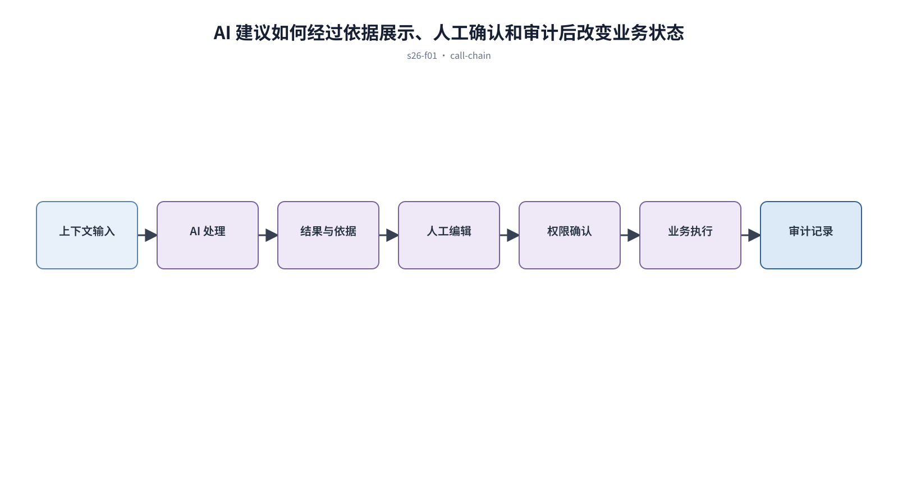

## 前置知识与学习目标

**前置知识：** 理解表单、状态机、权限、错误恢复和质量门。

**本篇唯一核心问题：** 怎样让 AI 产品对输入、处理、结果依据和用户控制保持透明？

读完后，你应该能够：能设计 AI 请求从上下文输入到结果采纳的可控闭环。本篇沿用“跨端客户工单管理 SaaS”，核心对象统一为 `ticket`、`customer`、`assignee`、`status`、`priority` 与 `permission`。

上一章已经解决“怎样把 token、组件 API、页面模式和质量门接入前端工程”的问题；本篇把它作为输入，不再重复完整解释。

## 从真实问题出发

AI 自动总结工单并建议关闭，用户看不到依据，也无法判断哪些字段会发送给模型。

先不要急着选择组件或颜色。应先写清楚当前用户、对象、触发条件、成功结果和失败后仍需保留的上下文，再判断界面应该表达什么。

## 核心机制

AI 界面需要同时表达能力与不确定性。输入区说明范围与隐私，过程区显示可取消状态，结果区区分事实与生成内容，控制区允许编辑、重试、比较和拒绝。

<!-- series-figure:s26-f01 -->



<!-- series-figure:end -->

### 1. 提交前展示将使用的上下文和敏感信息处理方式

提交前展示将使用的上下文和敏感信息处理方式。它先固定主路径和优先级，后续布局不得反过来改变业务判断。验收时要用真实任务观察用户能否找到下一步。

### 2. 长任务提供阶段、取消和后台继续能力，不使用无限等待

长任务提供阶段、取消和后台继续能力，不使用无限等待。它把抽象原则转换成可见结构。验收时应检查对象、标签、状态和操作是否逐项对应，而不是凭整体观感打分。

### 3. 结果标出来源、时间和不确定性，不把建议伪装为已执行动作

结果标出来源、时间和不确定性，不把建议伪装为已执行动作。它负责异常与边界，必须使用空数据、慢请求、权限差异或冲突数据复测，不能只验证理想状态。

### 4. 高风险动作必须由有权限的人确认，并记录模型版本、输入和采纳结果

高风险动作必须由有权限的人确认，并记录模型版本、输入和采纳结果。它防止局部页面自行发明规则。跨端、跨主题或跨角色检查时，语义保持一致，呈现方式才允许重组。

## 关键角色、数据与状态

| 项目     | 在本篇中的含义                                                                       |
| -------- | ------------------------------------------------------------------------------------ | ------ | --------- |
| 输入     | draft → submitted → running → completed                                              | failed | cancelled |
| 业务对象 | `ticket` 是工单，`customer` 是客户，`assignee` 是当前负责人                          |
| 约束     | `permission` 决定可执行动作；`priority` 影响排序，不直接替代业务状态                 |
| 状态主线 | `draft → submitted → processing → resolved → closed`，只有满足权限和前置条件才能转换 |
| 输出     | 能设计 AI 请求从上下文输入到结果采纳的可控闭环。                                     |

draft → submitted → running → completed|failed|cancelled；completed 后仍区分 suggested、edited、accepted、rejected。

## 最小实践：贯穿工单案例

AI 生成工单回复时列出引用的客户消息，客服可编辑并确认发送；模型只建议关闭，真正状态转换仍由有权限的客服触发。

执行时使用下面的决策记录，避免示例只有结果而没有中间状态：

```text
输入：角色、ticket、当前 status、permission、终端与网络状态
检查：核心任务、业务规则、可见反馈、失败恢复、跨端差异
中间状态：记录用户动作、系统判断、状态变化和仍被保留的数据
输出：可验证的界面方案、实现约束与验收证据
失败边界：权限不足、空数据、超时、冲突、长文案和窄屏
```

这里的 `status` 表示业务状态；请求的 loading/error 是界面请求状态，两者不能混为一个字段。示例中的数值与规则只用于教学，接入真实项目时必须由产品规则、接口契约和数据字典确认。

## 常见误区

- **用拟人化动画掩盖等待：** 这会让界面结论失去可验证依据；应回到输入、状态和恢复路径重新检查。
- **不区分生成建议和系统事实：** 这会让界面结论失去可验证依据；应回到输入、状态和恢复路径重新检查。
- **让模型直接执行不可逆操作：** 这会让界面结论失去可验证依据；应回到输入、状态和恢复路径重新检查。

## 适用边界与不适用场景

- 高风险法律、医疗和财务决策需要独立治理与人工责任。
- 不能解释来源或无法安全回滚的任务不应默认自动执行。

如果当前任务没有多对象关系、状态变化或失败恢复，不要为了套用本章而制造额外组件和流程。复杂度必须来自真实认知问题。

## 自检题

1. 用一句话说明：怎样让 AI 产品对输入、处理、结果依据和用户控制保持透明？
2. 在工单案例中，输入、中间状态和输出分别是什么？
3. 本章方法在哪些场景不应直接套用？

<details>
<summary>查看答案</summary>

1. AI 界面需要同时表达能力与不确定性。输入区说明范围与隐私，过程区显示可取消状态，结果区区分事实与生成内容，控制区允许编辑、重试、比较和拒绝。
2. draft → submitted → running → completed|failed|cancelled；completed 后仍区分 suggested、edited、accepted、rejected。
3. 高风险法律、医疗和财务决策需要独立治理与人工责任。不能解释来源或无法安全回滚的任务不应默认自动执行。

</details>

## 本篇总结

能设计 AI 请求从上下文输入到结果采纳的可控闭环。真正的完成标准不是“看起来合理”，而是每条规则都能追溯到任务、数据、状态或规范，并能通过边界场景验证。

## 下一篇衔接

下一篇将解决“怎样把页面设计请求写成包含输入、约束、状态和验收的可执行提示词”。本篇输出的决策、约束和案例状态将作为它的直接输入。

## 资料来源

- [NIST AI Risk Management Framework](https://www.nist.gov/itl/ai-risk-management-framework)
- [NIST AI RMF Playbook](https://airc.nist.gov/airmf-resources/playbook/)
- [Nielsen Norman Group：AI UX](https://www.nngroup.com/articles/ai-paradigm/)
