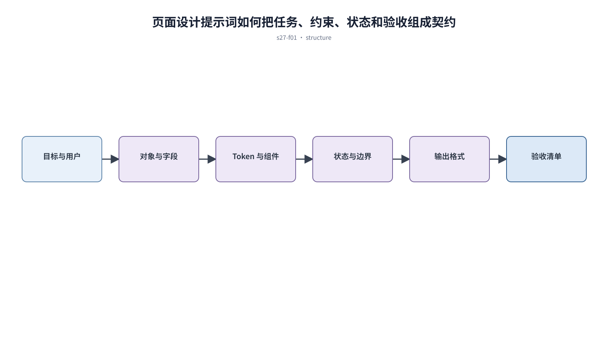

## 前置知识与学习目标

**前置知识：** 理解用户任务、组件系统、跨端状态和 AI 产品边界。

**本篇唯一核心问题：** 怎样把页面设计请求写成包含输入、约束、状态和验收的可执行提示词？

读完后，你应该能够：能用结构化提示词减少随机风格，并把输出交给确定性检查。本篇沿用“跨端客户工单管理 SaaS”，核心对象统一为 `ticket`、`customer`、`assignee`、`status`、`priority` 与 `permission`。

上一章已经解决“怎样让 AI 产品对输入、处理、结果依据和用户控制保持透明”的问题；本篇把它作为输入，不再重复完整解释。

## 从真实问题出发

团队只写“做一个高级后台”，模型每次生成不同组件、字段和视觉风格。

先不要急着选择组件或颜色。应先写清楚当前用户、对象、触发条件、成功结果和失败后仍需保留的上下文，再判断界面应该表达什么。

## 核心机制

提示词是任务契约，不是审美形容词集合。它需要目标、用户、对象、内容、状态、约束、输出格式和验收；未提供的数据必须标为待确认，不能让模型虚构。

<!-- series-figure:s27-f01 -->



<!-- series-figure:end -->

### 1. 先声明核心任务和用户决策，再提供页面类型和字段

先声明核心任务和用户决策，再提供页面类型和字段。它先固定主路径和优先级，后续布局不得反过来改变业务判断。验收时要用真实任务观察用户能否找到下一步。

### 2. 列出允许的 token、组件和页面模式，禁止新造视觉语言

列出允许的 token、组件和页面模式，禁止新造视觉语言。它把抽象原则转换成可见结构。验收时应检查对象、标签、状态和操作是否逐项对应，而不是凭整体观感打分。

### 3. 明确正常、加载、空、错误、权限和边界数据

明确正常、加载、空、错误、权限和边界数据。它负责异常与边界，必须使用空数据、慢请求、权限差异或冲突数据复测，不能只验证理想状态。

### 4. 要求输出结构、假设和验收清单，后续迭代一次只修改一个问题

要求输出结构、假设和验收清单，后续迭代一次只修改一个问题。它防止局部页面自行发明规则。跨端、跨主题或跨角色检查时，语义保持一致，呈现方式才允许重组。

## 关键角色、数据与状态

| 项目     | 在本篇中的含义                                                                       |
| -------- | ------------------------------------------------------------------------------------ |
| 输入     | 输入是需求与系统约束                                                                 |
| 业务对象 | `ticket` 是工单，`customer` 是客户，`assignee` 是当前负责人                          |
| 约束     | `permission` 决定可执行动作；`priority` 影响排序，不直接替代业务状态                 |
| 状态主线 | `draft → submitted → processing → resolved → closed`，只有满足权限和前置条件才能转换 |
| 输出     | 是可验证的布局、组件树、状态与实现说明。                                             |

输入是需求与系统约束；中间状态是结构化 prompt 和显式假设；输出是可验证的布局、组件树、状态与实现说明。

## 最小实践：贯穿工单案例

为工单列表提供角色、任务、字段、筛选、批量操作、组件白名单、六类状态和移动端重组要求；输出必须逐项对应验收表。

执行时使用下面的决策记录，避免示例只有结果而没有中间状态：

```text
输入：角色、ticket、当前 status、permission、终端与网络状态
检查：核心任务、业务规则、可见反馈、失败恢复、跨端差异
中间状态：记录用户动作、系统判断、状态变化和仍被保留的数据
输出：可验证的界面方案、实现约束与验收证据
失败边界：权限不足、空数据、超时、冲突、长文案和窄屏
```

这里的 `status` 表示业务状态；请求的 loading/error 是界面请求状态，两者不能混为一个字段。示例中的数值与规则只用于教学，接入真实项目时必须由产品规则、接口契约和数据字典确认。

## 常见误区

- **用高级、科技感等模糊词代替约束：** 这会让界面结论失去可验证依据；应回到输入、状态和恢复路径重新检查。
- **一次提示同时要求设计、编码和上线：** 这会让界面结论失去可验证依据；应回到输入、状态和恢复路径重新检查。
- **未提供真实字段却要求模型补全业务：** 这会让界面结论失去可验证依据；应回到输入、状态和恢复路径重新检查。

## 适用边界与不适用场景

- 提示词不能替代真实需求、用户研究和安全审查。
- 精确代码、公式和品牌资产仍需要确定性工具和人工验收。

如果当前任务没有多对象关系、状态变化或失败恢复，不要为了套用本章而制造额外组件和流程。复杂度必须来自真实认知问题。

## 自检题

1. 用一句话说明：怎样把页面设计请求写成包含输入、约束、状态和验收的可执行提示词？
2. 在工单案例中，输入、中间状态和输出分别是什么？
3. 本章方法在哪些场景不应直接套用？

<details>
<summary>查看答案</summary>

1. 提示词是任务契约，不是审美形容词集合。它需要目标、用户、对象、内容、状态、约束、输出格式和验收；未提供的数据必须标为待确认，不能让模型虚构。
2. 输入是需求与系统约束；中间状态是结构化 prompt 和显式假设；输出是可验证的布局、组件树、状态与实现说明。
3. 提示词不能替代真实需求、用户研究和安全审查。精确代码、公式和品牌资产仍需要确定性工具和人工验收。

</details>

## 本篇总结

能用结构化提示词减少随机风格，并把输出交给确定性检查。真正的完成标准不是“看起来合理”，而是每条规则都能追溯到任务、数据、状态或规范，并能通过边界场景验证。

## 下一篇衔接

下一篇将解决“怎样从参考图和流程证据提取约束，再安全落地为可维护代码”。本篇输出的决策、约束和案例状态将作为它的直接输入。

## 资料来源

- [NIST AI RMF Playbook](https://airc.nist.gov/airmf-resources/playbook/)
- [Design Tokens Community Group](https://www.designtokens.org/)
- [Nielsen Norman Group：10 Usability Heuristics](https://www.nngroup.com/articles/ten-usability-heuristics/)
