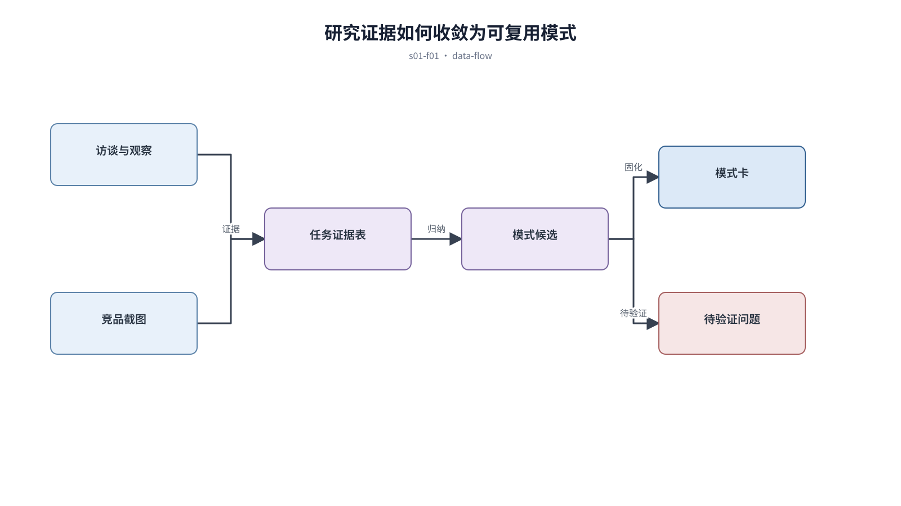

## 前置知识与学习目标

**前置知识：** 能够描述产品目标和主要用户；不要求掌握专业研究方法。

**本篇唯一核心问题：** 怎样把零散访谈与竞品截图转成可复用的设计证据，而不是照抄界面？

读完后，你应该能够：建立“任务—证据—模式—约束”的研究链路，并产出可交给后续信息架构工作的模式卡。本篇沿用“跨端客户工单管理 SaaS”，核心对象统一为 `ticket`、`customer`、`assignee`、`status`、`priority` 与 `permission`。

这是系列起点。先建立证据链，后续章节才有可靠输入，而不是从个人审美直接开始画页面。

## 从真实问题出发

工单团队准备重做工作台，但运营、客服和主管都说自己的任务最重要。

先不要急着选择组件或颜色。应先写清楚当前用户、对象、触发条件、成功结果和失败后仍需保留的上下文，再判断界面应该表达什么。

## 核心机制

先记录用户在何种情境下完成什么任务，再观察阻塞、替代行为和结果；竞品只用于验证可能的解决模式。证据必须保留来源与上下文，模式卡则把多个证据收敛成可复用约束。

<!-- series-figure:s01-f01 -->



<!-- series-figure:end -->

### 1. 研究对象按角色和任务抽样，不按方便程度找人

研究对象按角色和任务抽样，不按方便程度找人。它先固定主路径和优先级，后续布局不得反过来改变业务判断。验收时要用真实任务观察用户能否找到下一步。

### 2. 截图拆成入口、信息层级、状态、操作和跨端差异，不能只评价视觉

截图拆成入口、信息层级、状态、操作和跨端差异，不能只评价视觉。它把抽象原则转换成可见结构。验收时应检查对象、标签、状态和操作是否逐项对应，而不是凭整体观感打分。

### 3. 事实、解释和设计建议分栏记录，避免把假设写成结论

事实、解释和设计建议分栏记录，避免把假设写成结论。它负责异常与边界，必须使用空数据、慢请求、权限差异或冲突数据复测，不能只验证理想状态。

### 4. 只有被多个证据支持的做法才进入模式库；单一样本保留为待验证假设

只有被多个证据支持的做法才进入模式库；单一样本保留为待验证假设。它防止局部页面自行发明规则。跨端、跨主题或跨角色检查时，语义保持一致，呈现方式才允许重组。

## 关键角色、数据与状态

| 项目     | 在本篇中的含义                                                                       |
| -------- | ------------------------------------------------------------------------------------ |
| 输入     | 输入是访谈记录与带来源截图                                                           |
| 业务对象 | `ticket` 是工单，`customer` 是客户，`assignee` 是当前负责人                          |
| 约束     | `permission` 决定可执行动作；`priority` 影响排序，不直接替代业务状态                 |
| 状态主线 | `draft → submitted → processing → resolved → closed`，只有满足权限和前置条件才能转换 |
| 输出     | 是带置信度的模式卡与待验证问题。                                                     |

输入是访谈记录与带来源截图；中间状态是任务证据表和模式候选；输出是带置信度的模式卡与待验证问题。

## 最小实践：贯穿工单案例

选择客服、主管各两名，记录他们处理超时工单的真实步骤；再对比三个同类产品的提醒入口，形成“异常必须同时出现在列表、工作台和通知中心”的模式卡。

执行时使用下面的决策记录，避免示例只有结果而没有中间状态：

```text
输入：角色、ticket、当前 status、permission、终端与网络状态
检查：核心任务、业务规则、可见反馈、失败恢复、跨端差异
中间状态：记录用户动作、系统判断、状态变化和仍被保留的数据
输出：可验证的界面方案、实现约束与验收证据
失败边界：权限不足、空数据、超时、冲突、长文案和窄屏
```

这里的 `status` 表示业务状态；请求的 loading/error 是界面请求状态，两者不能混为一个字段。示例中的数值与规则只用于教学，接入真实项目时必须由产品规则、接口契约和数据字典确认。

## 常见误区

- **把竞品存在当作正确性证明：** 这会让界面结论失去可验证依据；应回到输入、状态和恢复路径重新检查。
- **只问用户喜欢什么，不观察实际任务：** 这会让界面结论失去可验证依据；应回到输入、状态和恢复路径重新检查。
- **删除与既定方案冲突的证据：** 这会让界面结论失去可验证依据；应回到输入、状态和恢复路径重新检查。

## 适用边界与不适用场景

- 低风险、一次性的内部页面可以采用轻量访谈，但仍要记录任务与假设。
- 涉及支付、安全或无障碍时，竞品拆解不能代替规范与真实验证。

如果当前任务没有多对象关系、状态变化或失败恢复，不要为了套用本章而制造额外组件和流程。复杂度必须来自真实认知问题。

## 自检题

1. 用一句话说明：怎样把零散访谈与竞品截图转成可复用的设计证据，而不是照抄界面？
2. 在工单案例中，输入、中间状态和输出分别是什么？
3. 本章方法在哪些场景不应直接套用？

<details>
<summary>查看答案</summary>

1. 先记录用户在何种情境下完成什么任务，再观察阻塞、替代行为和结果；竞品只用于验证可能的解决模式。证据必须保留来源与上下文，模式卡则把多个证据收敛成可复用约束。
2. 输入是访谈记录与带来源截图；中间状态是任务证据表和模式候选；输出是带置信度的模式卡与待验证问题。
3. 低风险、一次性的内部页面可以采用轻量访谈，但仍要记录任务与假设。涉及支付、安全或无障碍时，竞品拆解不能代替规范与真实验证。

</details>

## 本篇总结

建立“任务—证据—模式—约束”的研究链路，并产出可交给后续信息架构工作的模式卡。真正的完成标准不是“看起来合理”，而是每条规则都能追溯到任务、数据、状态或规范，并能通过边界场景验证。

## 下一篇衔接

下一篇将解决“怎样把业务对象和用户任务组织成不会让人迷路的信息架构”。本篇输出的决策、约束和案例状态将作为它的直接输入。

## 资料来源

- [GOV.UK Service Manual：User research](https://www.gov.uk/service-manual/user-research)
- [Nielsen Norman Group：User Interviews](https://www.nngroup.com/articles/user-interviews/)
- [Nielsen Norman Group：Competitive Analysis](https://www.nngroup.com/articles/competitive-usability-evaluations/)
