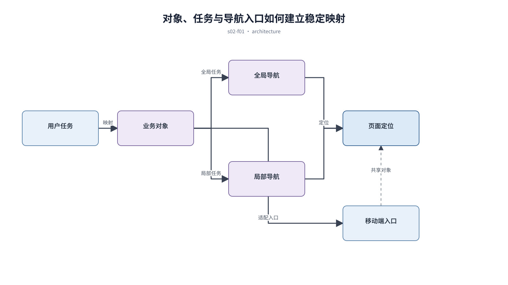

## 前置知识与学习目标

**前置知识：** 已完成任务研究，手中有角色、任务、对象和高频路径清单。

**本篇唯一核心问题：** 怎样把业务对象和用户任务组织成不会让人迷路的信息架构？

读完后，你应该能够：能区分对象、功能和任务路径，设计全局导航、局部导航与页面定位线索。本篇沿用“跨端客户工单管理 SaaS”，核心对象统一为 `ticket`、`customer`、`assignee`、`status`、`priority` 与 `permission`。

上一章已经解决“怎样把零散访谈与竞品截图转成可复用的设计证据，而不是照抄界面”的问题；本篇把它作为输入，不再重复完整解释。

## 从真实问题出发

工单系统把“客户、工单、统计、配置、自动化”都平铺在一级导航，客服需要反复跳转。

先不要急着选择组件或颜色。应先写清楚当前用户、对象、触发条件、成功结果和失败后仍需保留的上下文，再判断界面应该表达什么。

## 核心机制

信息架构先定义用户寻找什么，再决定放在哪里。对象回答“我在管理什么”，任务回答“我要完成什么”，导航只是把两者映射为稳定入口。层级应以用户心智模型为主，以组织架构为辅。

<!-- series-figure:s02-f01 -->



<!-- series-figure:end -->

### 1. 一级导航承载稳定业务域，临时活动和低频配置不得抢占一级位置

一级导航承载稳定业务域，临时活动和低频配置不得抢占一级位置。它先固定主路径和优先级，后续布局不得反过来改变业务判断。验收时要用真实任务观察用户能否找到下一步。

### 2. 列表、详情和操作围绕同一业务对象闭环，避免详情页变成跨模块链接仓库

列表、详情和操作围绕同一业务对象闭环，避免详情页变成跨模块链接仓库。它把抽象原则转换成可见结构。验收时应检查对象、标签、状态和操作是否逐项对应，而不是凭整体观感打分。

### 3. 当前位置同时由选中导航、页面标题和必要的面包屑表达

当前位置同时由选中导航、页面标题和必要的面包屑表达。它负责异常与边界，必须使用空数据、慢请求、权限差异或冲突数据复测，不能只验证理想状态。

### 4. 移动端保留高频任务入口，低频层级通过更多菜单或上下文操作进入

移动端保留高频任务入口，低频层级通过更多菜单或上下文操作进入。它防止局部页面自行发明规则。跨端、跨主题或跨角色检查时，语义保持一致，呈现方式才允许重组。

## 关键角色、数据与状态

| 项目     | 在本篇中的含义                                                                       |
| -------- | ------------------------------------------------------------------------------------ |
| 输入     | 输入是任务频率、对象关系和权限范围                                                   |
| 业务对象 | `ticket` 是工单，`customer` 是客户，`assignee` 是当前负责人                          |
| 约束     | `permission` 决定可执行动作；`priority` 影响排序，不直接替代业务状态                 |
| 状态主线 | `draft → submitted → processing → resolved → closed`，只有满足权限和前置条件才能转换 |
| 输出     | 是导航层级和关键任务路径。                                                           |

输入是任务频率、对象关系和权限范围；中间状态是内容清单、对象地图与树测试；输出是导航层级和关键任务路径。

## 最小实践：贯穿工单案例

以 `ticket` 为中心，把客户信息作为关联对象，把分派、升级、关闭作为工单任务；主管的“异常工单”入口保留在工作台，但落点仍是带筛选条件的工单列表。

执行时使用下面的决策记录，避免示例只有结果而没有中间状态：

```text
输入：角色、ticket、当前 status、permission、终端与网络状态
检查：核心任务、业务规则、可见反馈、失败恢复、跨端差异
中间状态：记录用户动作、系统判断、状态变化和仍被保留的数据
输出：可验证的界面方案、实现约束与验收证据
失败边界：权限不足、空数据、超时、冲突、长文案和窄屏
```

这里的 `status` 表示业务状态；请求的 loading/error 是界面请求状态，两者不能混为一个字段。示例中的数值与规则只用于教学，接入真实项目时必须由产品规则、接口契约和数据字典确认。

## 常见误区

- **按公司部门复制导航：** 这会让界面结论失去可验证依据；应回到输入、状态和恢复路径重新检查。
- **把所有功能都提升到一级：** 这会让界面结论失去可验证依据；应回到输入、状态和恢复路径重新检查。
- **用面包屑补救本身混乱的层级：** 这会让界面结论失去可验证依据；应回到输入、状态和恢复路径重新检查。

## 适用边界与不适用场景

- 只有一个核心任务的轻应用不需要复杂多级导航。
- 权限差异很大时应隐藏不可达域，但仍需提供明确的无权限解释。

如果当前任务没有多对象关系、状态变化或失败恢复，不要为了套用本章而制造额外组件和流程。复杂度必须来自真实认知问题。

## 自检题

1. 用一句话说明：怎样把业务对象和用户任务组织成不会让人迷路的信息架构？
2. 在工单案例中，输入、中间状态和输出分别是什么？
3. 本章方法在哪些场景不应直接套用？

<details>
<summary>查看答案</summary>

1. 信息架构先定义用户寻找什么，再决定放在哪里。对象回答“我在管理什么”，任务回答“我要完成什么”，导航只是把两者映射为稳定入口。层级应以用户心智模型为主，以组织架构为辅。
2. 输入是任务频率、对象关系和权限范围；中间状态是内容清单、对象地图与树测试；输出是导航层级和关键任务路径。
3. 只有一个核心任务的轻应用不需要复杂多级导航。权限差异很大时应隐藏不可达域，但仍需提供明确的无权限解释。

</details>

## 本篇总结

能区分对象、功能和任务路径，设计全局导航、局部导航与页面定位线索。真正的完成标准不是“看起来合理”，而是每条规则都能追溯到任务、数据、状态或规范，并能通过边界场景验证。

## 下一篇衔接

下一篇将解决“为什么业务页面的专业感首先来自可预测的信息层级，而不是装饰效果”。本篇输出的决策、约束和案例状态将作为它的直接输入。

## 资料来源

- [Nielsen Norman Group：Information Architecture](https://www.nngroup.com/articles/information-architecture-sitemaps/)
- [WAI：Multiple Ways](https://www.w3.org/WAI/WCAG22/Understanding/multiple-ways.html)
- [Apple HIG：Navigation and search](https://developer.apple.com/design/human-interface-guidelines/navigation-and-search)
