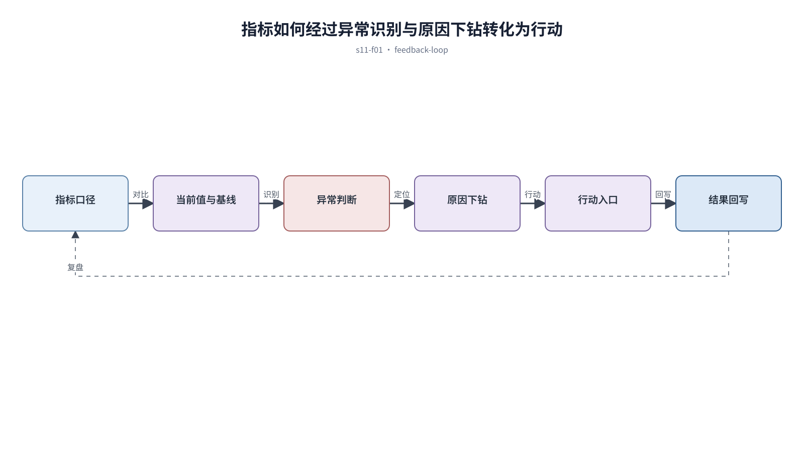

## 前置知识与学习目标

**前置知识：** 理解业务对象、数据表格和状态反馈。

**本篇唯一核心问题：** 怎样把工作台和 Dashboard 从指标陈列柜变成决策与行动入口？

读完后，你应该能够：能选择面向决策的指标，并把异常、原因和动作串成闭环。本篇沿用“跨端客户工单管理 SaaS”，核心对象统一为 `ticket`、`customer`、`assignee`、`status`、`priority` 与 `permission`。

上一章已经解决“怎样让数据表格支持比较、定位和批量行动，而不是堆满字段”的问题；本篇把它作为输入，不再重复完整解释。

## 从真实问题出发

主管工作台展示十几个同比数字，却看不出今天最需要处理什么。

先不要急着选择组件或颜色。应先写清楚当前用户、对象、触发条件、成功结果和失败后仍需保留的上下文，再判断界面应该表达什么。

## 核心机制

工作台回答“现在是否正常、哪里异常、为什么、下一步做什么”。指标必须对应决策；趋势提供上下文，异常提供优先级，待办和下钻把观察转为行动。

<!-- series-figure:s11-f01 -->



<!-- series-figure:end -->

### 1. 首屏指标不按可获得数据选择，而按主管需要作出的决策选择

首屏指标不按可获得数据选择，而按主管需要作出的决策选择。它先固定主路径和优先级，后续布局不得反过来改变业务判断。验收时要用真实任务观察用户能否找到下一步。

### 2. 每个数字同时说明时间范围、口径、更新时间和比较基线

每个数字同时说明时间范围、口径、更新时间和比较基线。它把抽象原则转换成可见结构。验收时应检查对象、标签、状态和操作是否逐项对应，而不是凭整体观感打分。

### 3. 异常卡展示影响范围与下钻入口，不只用红色制造紧迫感

异常卡展示影响范围与下钻入口，不只用红色制造紧迫感。它负责异常与边界，必须使用空数据、慢请求、权限差异或冲突数据复测，不能只验证理想状态。

### 4. 个性化隐藏不相关模块，但关键风险和权限通知不可被关闭

个性化隐藏不相关模块，但关键风险和权限通知不可被关闭。它防止局部页面自行发明规则。跨端、跨主题或跨角色检查时，语义保持一致，呈现方式才允许重组。

## 关键角色、数据与状态

| 项目     | 在本篇中的含义                                                                       |
| -------- | ------------------------------------------------------------------------------------ |
| 输入     | 输入是决策、指标口径和待办                                                           |
| 业务对象 | `ticket` 是工单，`customer` 是客户，`assignee` 是当前负责人                          |
| 约束     | `permission` 决定可执行动作；`priority` 影响排序，不直接替代业务状态                 |
| 状态主线 | `draft → submitted → processing → resolved → closed`，只有满足权限和前置条件才能转换 |
| 输出     | 是明确优先级的行动列表。                                                             |

输入是决策、指标口径和待办；中间状态是正常/异常判断与原因下钻；输出是明确优先级的行动列表。

## 最小实践：贯穿工单案例

工作台显示“超时工单 18 条，比昨日 +6”，点击后进入固定筛选的工单列表；旁边提供按团队拆分和“重新分派”动作。

执行时使用下面的决策记录，避免示例只有结果而没有中间状态：

```text
输入：角色、ticket、当前 status、permission、终端与网络状态
检查：核心任务、业务规则、可见反馈、失败恢复、跨端差异
中间状态：记录用户动作、系统判断、状态变化和仍被保留的数据
输出：可验证的界面方案、实现约束与验收证据
失败边界：权限不足、空数据、超时、冲突、长文案和窄屏
```

这里的 `status` 表示业务状态；请求的 loading/error 是界面请求状态，两者不能混为一个字段。示例中的数值与规则只用于教学，接入真实项目时必须由产品规则、接口契约和数据字典确认。

## 常见误区

- **把所有可用指标都放首屏：** 这会让界面结论失去可验证依据；应回到输入、状态和恢复路径重新检查。
- **只显示涨跌不显示基线：** 这会让界面结论失去可验证依据；应回到输入、状态和恢复路径重新检查。
- **图表无法下钻到业务对象：** 这会让界面结论失去可验证依据；应回到输入、状态和恢复路径重新检查。

## 适用边界与不适用场景

- 探索型分析需要更灵活的分析工具，不宜被固定工作台替代。
- 公开大屏与内部工作台的观看距离、隐私和交互能力不同。

如果当前任务没有多对象关系、状态变化或失败恢复，不要为了套用本章而制造额外组件和流程。复杂度必须来自真实认知问题。

## 自检题

1. 用一句话说明：怎样把工作台和 Dashboard 从指标陈列柜变成决策与行动入口？
2. 在工单案例中，输入、中间状态和输出分别是什么？
3. 本章方法在哪些场景不应直接套用？

<details>
<summary>查看答案</summary>

1. 工作台回答“现在是否正常、哪里异常、为什么、下一步做什么”。指标必须对应决策；趋势提供上下文，异常提供优先级，待办和下钻把观察转为行动。
2. 输入是决策、指标口径和待办；中间状态是正常/异常判断与原因下钻；输出是明确优先级的行动列表。
3. 探索型分析需要更灵活的分析工具，不宜被固定工作台替代。公开大屏与内部工作台的观看距离、隐私和交互能力不同。

</details>

## 本篇总结

能选择面向决策的指标，并把异常、原因和动作串成闭环。真正的完成标准不是“看起来合理”，而是每条规则都能追溯到任务、数据、状态或规范，并能通过边界场景验证。

## 下一篇衔接

下一篇将解决“怎样按分析任务选择图表，并让大屏中的趋势、对比和异常可解释”。本篇输出的决策、约束和案例状态将作为它的直接输入。

## 资料来源

- [Nielsen Norman Group：10 Usability Heuristics](https://www.nngroup.com/articles/ten-usability-heuristics/)
- [Carbon Charts：Guidance](https://charts.carbondesignsystem.com/)
- [WAI：Charts Concepts](https://www.w3.org/WAI/tutorials/images/complex/)
