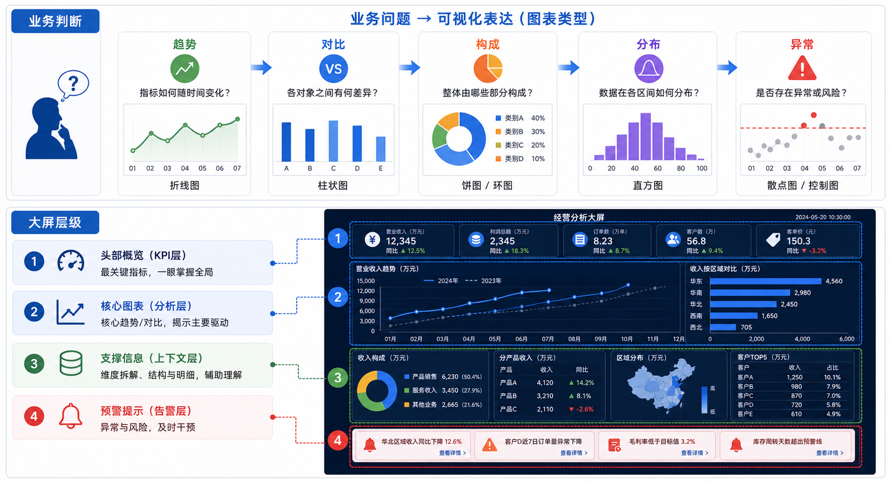

## 核心结论

数据可视化不是把数据变成图，而是帮助用户看见趋势、对比、构成、分布和异常。大屏也不是炫技舞台，而是远距离快速理解业务状态的工具。

图表越复杂，越需要说明它回答的问题。



## 图表选择

折线图适合趋势，柱状图适合比较，饼图只适合少量构成，散点图适合相关关系，地图适合地理分布。不要为了视觉效果选择不合适的图。

如果用户需要精确比较数值，表格可能比图表更好。

## 大屏原则

大屏要控制信息密度。远距离阅读时，小字、细线、复杂筛选和密集按钮都会失效。大屏更适合核心指标、趋势图、异常列表、地图态势和实时动态。

颜色要服务状态，不要把所有区域都做成高饱和霓虹效果。

## 数据解释

图表应该包含标题、时间范围、单位、数据来源和异常说明。一个没有单位的指标，很难让用户建立信任。

异常数据要能下钻，至少说明异常对象、时间和影响范围。

## AI 开发提示词

```text
请为【业务场景】设计数据看板或大屏。
请说明每个图表回答什么问题，选择什么图表类型，数据来源、时间范围、单位和异常提示是什么。
要求远距离可读，不要堆砌装饰性图表。
```

## 检查清单

- 每个图表是否回答明确业务问题？
- 是否标注单位和时间范围？
- 异常是否足够醒目？
- 大屏远距离是否可读？
- 是否避免只靠颜色区分数据？

## 参考来源

- IBM Carbon Design System：https://carbondesignsystem.com/
- Material Design 3：https://m3.material.io/
- WCAG 2.2：https://www.w3.org/TR/WCAG22/

