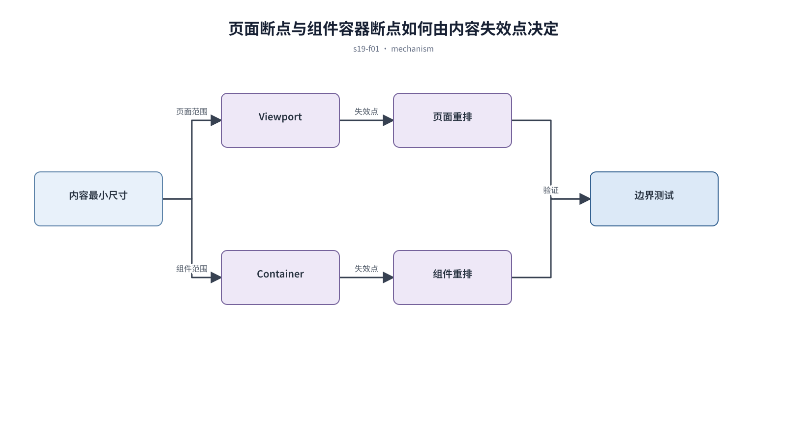

## 前置知识与学习目标

**前置知识：** 理解多端重组、触控目标和内容优先级。

**本篇唯一核心问题：** 怎样根据内容失效点选择断点，并让组件在容器中稳定重排？

读完后，你应该能够：能区分 viewport media query 与 container query，并设计内容驱动的重排规则。本篇沿用“跨端客户工单管理 SaaS”，核心对象统一为 `ticket`、`customer`、`assignee`、`status`、`priority` 与 `permission`。

上一章已经解决“怎样为触控目标、拇指可达性和手势失败设计可发现的移动端交互”的问题；本篇把它作为输入，不再重复完整解释。

## 从真实问题出发

页面按设备型号设置大量断点，新增侧栏后相同卡片在同一视口出现两种破损状态。

先不要急着选择组件或颜色。应先写清楚当前用户、对象、触发条件、成功结果和失败后仍需保留的上下文，再判断界面应该表达什么。

## 核心机制

断点应出现在内容无法保持可读和可操作的时刻。页面级结构通常由 viewport 控制，可复用组件更适合根据容器宽度调整；稳定尺寸如触控目标不应随视口无限缩小。

<!-- series-figure:s19-f01 -->



<!-- series-figure:end -->

### 1. 从最窄可用布局开始，逐步增加空间与并列关系

从最窄可用布局开始，逐步增加空间与并列关系。它先固定主路径和优先级，后续布局不得反过来改变业务判断。验收时要用真实任务观察用户能否找到下一步。

### 2. 记录每个断点解决的具体失效现象，不以设备名命名

记录每个断点解决的具体失效现象，不以设备名命名。它把抽象原则转换成可见结构。验收时应检查对象、标签、状态和操作是否逐项对应，而不是凭整体观感打分。

### 3. 组件使用 `container-type: inline-size` 后按自身可用宽度切换结构

组件使用 `container-type: inline-size` 后按自身可用宽度切换结构。它负责异常与边界，必须使用空数据、慢请求、权限差异或冲突数据复测，不能只验证理想状态。

### 4. 测试长文案、缩放、侧栏开关和用户字体，而不只测试标准截图宽度

测试长文案、缩放、侧栏开关和用户字体，而不只测试标准截图宽度。它防止局部页面自行发明规则。跨端、跨主题或跨角色检查时，语义保持一致，呈现方式才允许重组。

## 关键角色、数据与状态

| 项目     | 在本篇中的含义                                                                       |
| -------- | ------------------------------------------------------------------------------------ |
| 输入     | 输入是内容最小尺寸和容器约束                                                         |
| 业务对象 | `ticket` 是工单，`customer` 是客户，`assignee` 是当前负责人                          |
| 约束     | `permission` 决定可执行动作；`priority` 影响排序，不直接替代业务状态                 |
| 状态主线 | `draft → submitted → processing → resolved → closed`，只有满足权限和前置条件才能转换 |
| 输出     | 是少量、可解释的重排规则。                                                           |

输入是内容最小尺寸和容器约束；中间状态是失效点测试；输出是少量、可解释的重排规则。

## 最小实践：贯穿工单案例

工单摘要在容器小于 36rem 时把负责人和 SLA 移到第二行；页面小于 64rem 时关闭固定详情栏，但主操作尺寸保持不变。

执行时使用下面的决策记录，避免示例只有结果而没有中间状态：

```text
输入：角色、ticket、当前 status、permission、终端与网络状态
检查：核心任务、业务规则、可见反馈、失败恢复、跨端差异
中间状态：记录用户动作、系统判断、状态变化和仍被保留的数据
输出：可验证的界面方案、实现约束与验收证据
失败边界：权限不足、空数据、超时、冲突、长文案和窄屏
```

这里的 `status` 表示业务状态；请求的 loading/error 是界面请求状态，两者不能混为一个字段。示例中的数值与规则只用于教学，接入真实项目时必须由产品规则、接口契约和数据字典确认。

## 常见误区

- **按热门设备宽度抄断点：** 这会让界面结论失去可验证依据；应回到输入、状态和恢复路径重新检查。
- **隐藏关键信息来避免换行：** 这会让界面结论失去可验证依据；应回到输入、状态和恢复路径重新检查。
- **组件只能在全宽页面正常显示：** 这会让界面结论失去可验证依据；应回到输入、状态和恢复路径重新检查。

## 适用边界与不适用场景

- 邮件等受限渲染环境需要更保守的布局策略。
- 容器查询不能替代业务层的端能力和任务重组。

如果当前任务没有多对象关系、状态变化或失败恢复，不要为了套用本章而制造额外组件和流程。复杂度必须来自真实认知问题。

## 自检题

1. 用一句话说明：怎样根据内容失效点选择断点，并让组件在容器中稳定重排？
2. 在工单案例中，输入、中间状态和输出分别是什么？
3. 本章方法在哪些场景不应直接套用？

<details>
<summary>查看答案</summary>

1. 断点应出现在内容无法保持可读和可操作的时刻。页面级结构通常由 viewport 控制，可复用组件更适合根据容器宽度调整；稳定尺寸如触控目标不应随视口无限缩小。
2. 输入是内容最小尺寸和容器约束；中间状态是失效点测试；输出是少量、可解释的重排规则。
3. 邮件等受限渲染环境需要更保守的布局策略。容器查询不能替代业务层的端能力和任务重组。

</details>

## 本篇总结

能区分 viewport media query 与 container query，并设计内容驱动的重排规则。真正的完成标准不是“看起来合理”，而是每条规则都能追溯到任务、数据、状态或规范，并能通过边界场景验证。

## 下一篇衔接

下一篇将解决“怎样把 WCAG 2.2 AA 转成页面设计和前端验收动作”。本篇输出的决策、约束和案例状态将作为它的直接输入。

## 资料来源

- [MDN：Using media queries](https://developer.mozilla.org/en-US/docs/Web/CSS/Guides/Media_queries/Using)
- [MDN：Container queries](https://developer.mozilla.org/en-US/docs/Web/CSS/Guides/Containment/Container_queries)
- [WCAG 2.2：Reflow](https://www.w3.org/WAI/WCAG22/Understanding/reflow.html)
