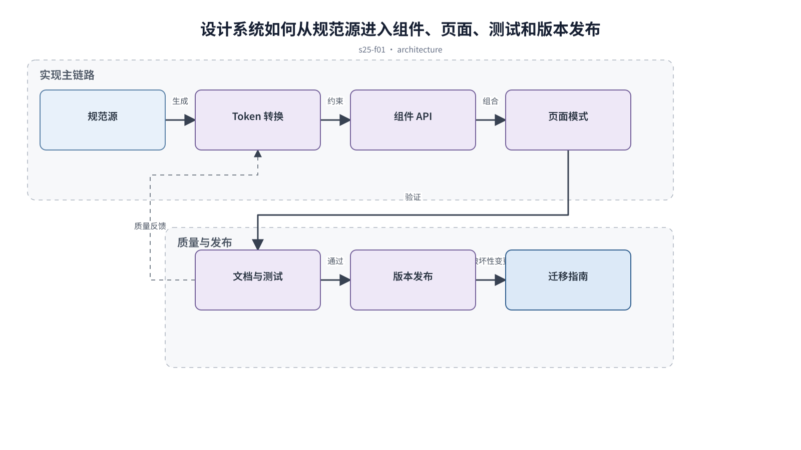

## 前置知识与学习目标

**前置知识：** 理解 Design Tokens、组件状态、响应式、暗色与国际化。

**本篇唯一核心问题：** 怎样把 token、组件 API、页面模式和质量门接入前端工程？

读完后，你应该能够：能设计从规范源到构建产物、文档、测试和发布的设计系统流水线。本篇沿用“跨端客户工单管理 SaaS”，核心对象统一为 `ticket`、`customer`、`assignee`、`status`、`priority` 与 `permission`。

上一章已经解决“怎样让布局、文案和数据格式真正支持本地化与 RTL”的问题；本篇把它作为输入，不再重复完整解释。

## 从真实问题出发

设计规范有完整文档，但前端仍复制 CSS，组件升级后各页面表现不一致。

先不要急着选择组件或颜色。应先写清楚当前用户、对象、触发条件、成功结果和失败后仍需保留的上下文，再判断界面应该表达什么。

## 核心机制

工程化设计系统由规范源、转换、组件实现、文档、测试和发布组成。token 需要生成平台代码，组件 API 表达可控变体，页面模式验证组合关系，质量门阻止未授权样式进入。

<!-- series-figure:s25-f01 -->



<!-- series-figure:end -->

### 1. token 有单一来源并生成 CSS/TS 等平台产物，禁止手改生成文件

token 有单一来源并生成 CSS/TS 等平台产物，禁止手改生成文件。它先固定主路径和优先级，后续布局不得反过来改变业务判断。验收时要用真实任务观察用户能否找到下一步。

### 2. 组件 API 使用语义属性，例如 `tone="danger"`，不暴露任意色值

组件 API 使用语义属性，例如 `tone="danger"`，不暴露任意色值。它把抽象原则转换成可见结构。验收时应检查对象、标签、状态和操作是否逐项对应，而不是凭整体观感打分。

### 3. 文档展示状态矩阵、可访问性和组合示例，不只展示理想截图

文档展示状态矩阵、可访问性和组合示例，不只展示理想截图。它负责异常与边界，必须使用空数据、慢请求、权限差异或冲突数据复测，不能只验证理想状态。

### 4. 发布包含版本、变更说明、视觉回归和迁移指南

发布包含版本、变更说明、视觉回归和迁移指南。它防止局部页面自行发明规则。跨端、跨主题或跨角色检查时，语义保持一致，呈现方式才允许重组。

## 关键角色、数据与状态

| 项目     | 在本篇中的含义                                                                                     |
| -------- | -------------------------------------------------------------------------------------------------- |
| 输入     | token source → transform → component API → page pattern → documentation/test → versioned release。 |
| 业务对象 | `ticket` 是工单，`customer` 是客户，`assignee` 是当前负责人                                        |
| 约束     | `permission` 决定可执行动作；`priority` 影响排序，不直接替代业务状态                               |
| 状态主线 | `draft → submitted → processing → resolved → closed`，只有满足权限和前置条件才能转换               |
| 输出     | 能设计从规范源到构建产物、文档、测试和发布的设计系统流水线。                                       |

token source → transform → component API → page pattern → documentation/test → versioned release。

## 最小实践：贯穿工单案例

更新 `color.action.primary` 后自动生成 CSS 变量，运行按钮与工单页面视觉回归；破坏性 API 变更发布迁移说明并保留过渡版本。

执行时使用下面的决策记录，避免示例只有结果而没有中间状态：

```text
输入：角色、ticket、当前 status、permission、终端与网络状态
检查：核心任务、业务规则、可见反馈、失败恢复、跨端差异
中间状态：记录用户动作、系统判断、状态变化和仍被保留的数据
输出：可验证的界面方案、实现约束与验收证据
失败边界：权限不足、空数据、超时、冲突、长文案和窄屏
```

这里的 `status` 表示业务状态；请求的 loading/error 是界面请求状态，两者不能混为一个字段。示例中的数值与规则只用于教学，接入真实项目时必须由产品规则、接口契约和数据字典确认。

## 常见误区

- **把设计文档当作唯一真相但代码不消费：** 这会让界面结论失去可验证依据；应回到输入、状态和恢复路径重新检查。
- **组件支持任意 style 覆盖：** 这会让界面结论失去可验证依据；应回到输入、状态和恢复路径重新检查。
- **只测组件，不测页面组合：** 这会让界面结论失去可验证依据；应回到输入、状态和恢复路径重新检查。

## 适用边界与不适用场景

- 小团队可从 token 和核心组件开始，不必一次建设完整平台。
- 业务逻辑不应塞进通用视觉组件，业务组件保留清晰边界。

如果当前任务没有多对象关系、状态变化或失败恢复，不要为了套用本章而制造额外组件和流程。复杂度必须来自真实认知问题。

## 自检题

1. 用一句话说明：怎样把 token、组件 API、页面模式和质量门接入前端工程？
2. 在工单案例中，输入、中间状态和输出分别是什么？
3. 本章方法在哪些场景不应直接套用？

<details>
<summary>查看答案</summary>

1. 工程化设计系统由规范源、转换、组件实现、文档、测试和发布组成。token 需要生成平台代码，组件 API 表达可控变体，页面模式验证组合关系，质量门阻止未授权样式进入。
2. token source → transform → component API → page pattern → documentation/test → versioned release。
3. 小团队可从 token 和核心组件开始，不必一次建设完整平台。业务逻辑不应塞进通用视觉组件，业务组件保留清晰边界。

</details>

## 本篇总结

能设计从规范源到构建产物、文档、测试和发布的设计系统流水线。真正的完成标准不是“看起来合理”，而是每条规则都能追溯到任务、数据、状态或规范，并能通过边界场景验证。

## 下一篇衔接

下一篇将解决“怎样让 AI 产品对输入、处理、结果依据和用户控制保持透明”。本篇输出的决策、约束和案例状态将作为它的直接输入。

## 资料来源

- [Design Tokens Community Group](https://www.designtokens.org/)
- [MDN：CSS custom properties](https://developer.mozilla.org/en-US/docs/Web/CSS/Guides/Cascading_variables/Using_custom_properties)
- [Storybook：Testing](https://storybook.js.org/docs/writing-tests)
