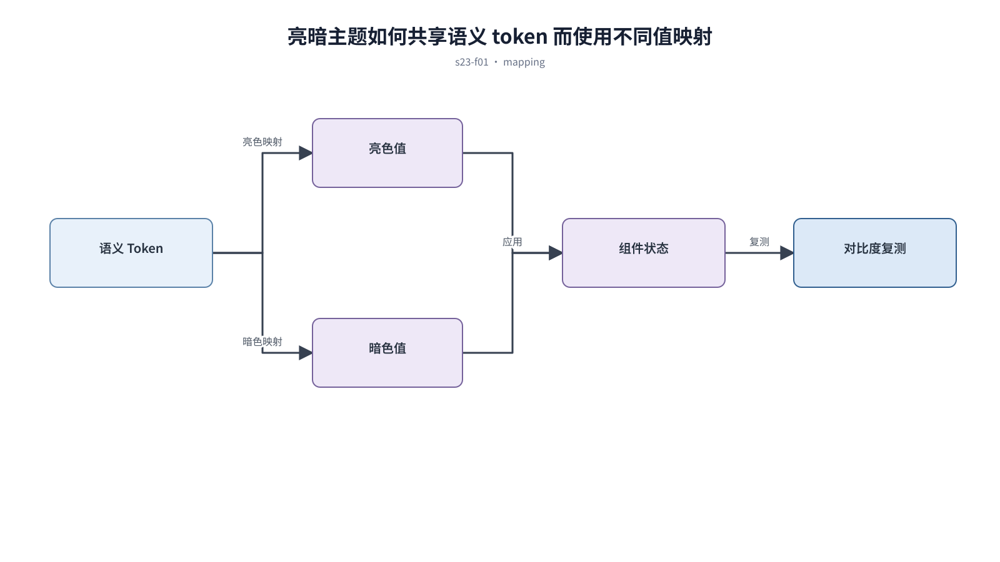

## 前置知识与学习目标

**前置知识：** 理解颜色语义、Design Tokens、图表和资产适配。

**本篇唯一核心问题：** 怎样用语义 token 重建暗色层级，而不是把亮色页面反相？

读完后，你应该能够：能定义暗色背景层级、文字、边框、状态、图片和系统偏好切换规则。本篇沿用“跨端客户工单管理 SaaS”，核心对象统一为 `ticket`、`customer`、`assignee`、`status`、`priority` 与 `permission`。

上一章已经解决“怎样为图标、插画和图片资产定义功能角色、来源和交付规格”的问题；本篇把它作为输入，不再重复完整解释。

## 从真实问题出发

页面通过滤镜反相生成暗色模式，品牌色刺眼，阴影消失，图片和状态色含义混乱。

先不要急着选择组件或颜色。应先写清楚当前用户、对象、触发条件、成功结果和失败后仍需保留的上下文，再判断界面应该表达什么。

## 核心机制

暗色主题是相同语义角色的另一套值映射。深色表面通过亮度层级和边框建立深度，文字与状态色重新校准对比度，图片与图表需要独立适配。

<!-- series-figure:s23-f01 -->



<!-- series-figure:end -->

### 1. 页面、容器、浮层和选中态使用可辨认但克制的表面层级

页面、容器、浮层和选中态使用可辨认但克制的表面层级。它先固定主路径和优先级，后续布局不得反过来改变业务判断。验收时要用真实任务观察用户能否找到下一步。

### 2. 正文、辅助文字和禁用态分别验证对比度，不使用纯白覆盖所有层级

正文、辅助文字和禁用态分别验证对比度，不使用纯白覆盖所有层级。它把抽象原则转换成可见结构。验收时应检查对象、标签、状态和操作是否逐项对应，而不是凭整体观感打分。

### 3. 品牌与语义色降低刺眼程度但保持含义，不能简单降低全局透明度

品牌与语义色降低刺眼程度但保持含义，不能简单降低全局透明度。它负责异常与边界，必须使用空数据、慢请求、权限差异或冲突数据复测，不能只验证理想状态。

### 4. 支持系统 `prefers-color-scheme`，同时允许用户选择并持久化偏好

支持系统 `prefers-color-scheme`，同时允许用户选择并持久化偏好。它防止局部页面自行发明规则。跨端、跨主题或跨角色检查时，语义保持一致，呈现方式才允许重组。

## 关键角色、数据与状态

| 项目     | 在本篇中的含义                                                                       |
| -------- | ------------------------------------------------------------------------------------ |
| 输入     | 输入是语义 token 和系统/用户偏好                                                     |
| 业务对象 | `ticket` 是工单，`customer` 是客户，`assignee` 是当前负责人                          |
| 约束     | `permission` 决定可执行动作；`priority` 影响排序，不直接替代业务状态                 |
| 状态主线 | `draft → submitted → processing → resolved → closed`，只有满足权限和前置条件才能转换 |
| 输出     | 是亮暗主题行为一致的界面。                                                           |

输入是语义 token 和系统/用户偏好；中间状态是主题映射与组件复测；输出是亮暗主题行为一致的界面。

## 最小实践：贯穿工单案例

`surface.page`、`surface.card`、`surface.overlay` 使用递增亮度；工单风险色在暗背景上重新选值，并用文字“紧急”保留语义。

执行时使用下面的决策记录，避免示例只有结果而没有中间状态：

```text
输入：角色、ticket、当前 status、permission、终端与网络状态
检查：核心任务、业务规则、可见反馈、失败恢复、跨端差异
中间状态：记录用户动作、系统判断、状态变化和仍被保留的数据
输出：可验证的界面方案、实现约束与验收证据
失败边界：权限不足、空数据、超时、冲突、长文案和窄屏
```

这里的 `status` 表示业务状态；请求的 loading/error 是界面请求状态，两者不能混为一个字段。示例中的数值与规则只用于教学，接入真实项目时必须由产品规则、接口契约和数据字典确认。

## 常见误区

- **对页面执行整体反相：** 这会让界面结论失去可验证依据；应回到输入、状态和恢复路径重新检查。
- **暗色主题继续使用亮色强阴影：** 这会让界面结论失去可验证依据；应回到输入、状态和恢复路径重新检查。
- **只测试首页而漏掉图表和错误态：** 这会让界面结论失去可验证依据；应回到输入、状态和恢复路径重新检查。

## 适用边界与不适用场景

- OLED 纯黑可用于特定场景，但大面积纯黑不自动等于更舒适。
- 品牌要求不能凌驾于文本和控件可读性。

如果当前任务没有多对象关系、状态变化或失败恢复，不要为了套用本章而制造额外组件和流程。复杂度必须来自真实认知问题。

## 自检题

1. 用一句话说明：怎样用语义 token 重建暗色层级，而不是把亮色页面反相？
2. 在工单案例中，输入、中间状态和输出分别是什么？
3. 本章方法在哪些场景不应直接套用？

<details>
<summary>查看答案</summary>

1. 暗色主题是相同语义角色的另一套值映射。深色表面通过亮度层级和边框建立深度，文字与状态色重新校准对比度，图片与图表需要独立适配。
2. 输入是语义 token 和系统/用户偏好；中间状态是主题映射与组件复测；输出是亮暗主题行为一致的界面。
3. OLED 纯黑可用于特定场景，但大面积纯黑不自动等于更舒适。品牌要求不能凌驾于文本和控件可读性。

</details>

## 本篇总结

能定义暗色背景层级、文字、边框、状态、图片和系统偏好切换规则。真正的完成标准不是“看起来合理”，而是每条规则都能追溯到任务、数据、状态或规范，并能通过边界场景验证。

## 下一篇衔接

下一篇将解决“怎样让布局、文案和数据格式真正支持本地化与 RTL”。本篇输出的决策、约束和案例状态将作为它的直接输入。

## 资料来源

- [Apple HIG：Dark Mode](https://developer.apple.com/design/human-interface-guidelines/dark-mode)
- [MDN：prefers-color-scheme](https://developer.mozilla.org/en-US/docs/Web/CSS/@media/prefers-color-scheme)
- [Material Design 3：Color roles](https://m3.material.io/styles/color/roles)
