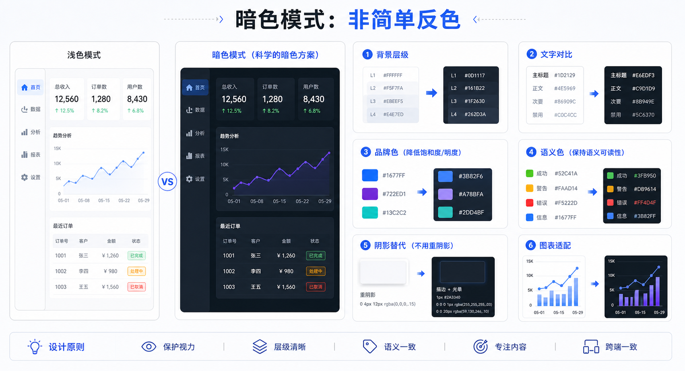

## 核心结论

暗色模式不是把白色变黑、黑色变白。它需要重新设计背景层级、边框、文字、品牌色、状态色和阴影表达。

简单反色通常会导致对比刺眼、层级丢失、图表难读和品牌色过亮。



## 背景层级

暗色模式中，背景不能只有一种黑。需要页面背景、容器背景、悬浮背景、边框和分割线的层级。

纯黑适合 OLED 节能场景，但企业系统里常用深灰更舒适。

## 文字对比

暗色背景上的纯白文字可能刺眼。可以使用接近白色的主文本和更柔和的次级文本。但不能为了柔和牺牲可读性。

辅助文字仍然需要满足足够对比度。

## 品牌色和语义色

浅色模式中的品牌色，在暗色模式里可能过亮或过饱和。需要单独定义暗色模式色值。

危险、警告、成功等语义色也要保持含义稳定，同时保证对比度。

## AI 开发提示词

```text
请为【系统】设计暗色模式。
请定义页面背景、容器背景、悬浮背景、边框、主文本、次级文本、品牌色、成功、警告、危险和图表颜色。
不要简单反色，要求说明层级和对比度。
```

## 检查清单

- 暗色模式是否有多个背景层级？
- 文字是否既清晰又不刺眼？
- 品牌色是否单独适配？
- 图表颜色是否可区分？
- 阴影是否用边框或背景层级替代？

## 参考来源

- Material Design 3：https://m3.material.io/
- Apple Human Interface Guidelines：https://developer.apple.com/design/human-interface-guidelines
- WCAG 2.2：https://www.w3.org/TR/WCAG22/

