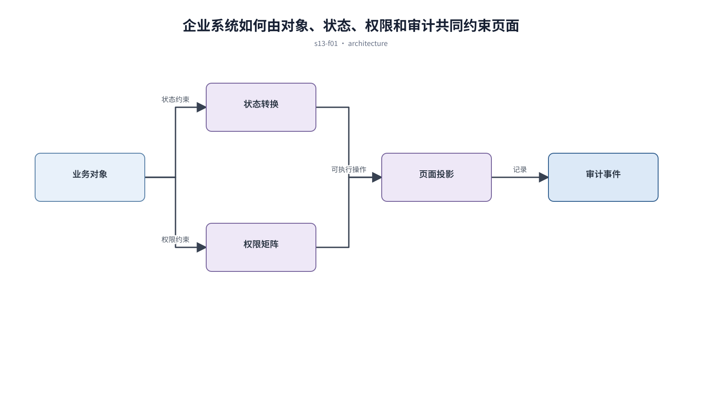

## 前置知识与学习目标

**前置知识：** 理解后台页面、表格、状态机和工作台。

**本篇唯一核心问题：** 怎样用对象、状态、权限和审计四个模型覆盖 SaaS、CRM 与 ERP 的通用业务复杂度？

读完后，你应该能够：能把复杂业务拆成稳定对象与受控状态流，而不是按页面逐个堆功能。本篇沿用“跨端客户工单管理 SaaS”，核心对象统一为 `ticket`、`customer`、`assignee`、`status`、`priority` 与 `permission`。

上一章已经解决“怎样按分析任务选择图表，并让大屏中的趋势、对比和异常可解释”的问题；本篇把它作为输入，不再重复完整解释。

## 从真实问题出发

系统为每个客户定制一套页面，最终同一种审批出现多个状态名和权限规则。

先不要急着选择组件或颜色。应先写清楚当前用户、对象、触发条件、成功结果和失败后仍需保留的上下文，再判断界面应该表达什么。

## 核心机制

企业系统的稳定骨架不是页面，而是对象、关系、状态转换、角色权限与审计事件。页面只是这些模型在具体任务下的投影。

<!-- series-figure:s13-f01 -->



<!-- series-figure:end -->

### 1. 对象拥有稳定标识、关键属性和关联关系，页面不复制对象真相

对象拥有稳定标识、关键属性和关联关系，页面不复制对象真相。它先固定主路径和优先级，后续布局不得反过来改变业务判断。验收时要用真实任务观察用户能否找到下一步。

### 2. 状态转换声明触发角色、前置条件、结果和失败原因

状态转换声明触发角色、前置条件、结果和失败原因。它把抽象原则转换成可见结构。验收时应检查对象、标签、状态和操作是否逐项对应，而不是凭整体观感打分。

### 3. 权限同时检查角色、对象范围和动作，隐藏按钮不能替代服务端授权

权限同时检查角色、对象范围和动作，隐藏按钮不能替代服务端授权。它负责异常与边界，必须使用空数据、慢请求、权限差异或冲突数据复测，不能只验证理想状态。

### 4. 审计记录谁在何时对哪个对象做了什么，以及前后值和请求来源

审计记录谁在何时对哪个对象做了什么，以及前后值和请求来源。它防止局部页面自行发明规则。跨端、跨主题或跨角色检查时，语义保持一致，呈现方式才允许重组。

## 关键角色、数据与状态

| 项目     | 在本篇中的含义                                                                       |
| -------- | ------------------------------------------------------------------------------------ |
| 输入     | 输入是业务规则                                                                       |
| 业务对象 | `ticket` 是工单，`customer` 是客户，`assignee` 是当前负责人                          |
| 约束     | `permission` 决定可执行动作；`priority` 影响排序，不直接替代业务状态                 |
| 状态主线 | `draft → submitted → processing → resolved → closed`，只有满足权限和前置条件才能转换 |
| 输出     | 是多个页面可共享的业务模式。                                                         |

输入是业务规则；中间状态是对象模型、状态机、权限矩阵和事件模型；输出是多个页面可共享的业务模式。

## 最小实践：贯穿工单案例

`ticket` 只能由客服从 submitted 转到 processing，主管可重新分派；每次变化记录 actor、before、after 和 timestamp。

执行时使用下面的决策记录，避免示例只有结果而没有中间状态：

```text
输入：角色、ticket、当前 status、permission、终端与网络状态
检查：核心任务、业务规则、可见反馈、失败恢复、跨端差异
中间状态：记录用户动作、系统判断、状态变化和仍被保留的数据
输出：可验证的界面方案、实现约束与验收证据
失败边界：权限不足、空数据、超时、冲突、长文案和窄屏
```

这里的 `status` 表示业务状态；请求的 loading/error 是界面请求状态，两者不能混为一个字段。示例中的数值与规则只用于教学，接入真实项目时必须由产品规则、接口契约和数据字典确认。

## 常见误区

- **把页面路由当成业务状态：** 这会让界面结论失去可验证依据；应回到输入、状态和恢复路径重新检查。
- **权限只控制前端显示：** 这会让界面结论失去可验证依据；应回到输入、状态和恢复路径重新检查。
- **日志只写操作成功而不写对象和前后值：** 这会让界面结论失去可验证依据；应回到输入、状态和恢复路径重新检查。

## 适用边界与不适用场景

- 简单内容展示站不需要完整企业对象模型。
- 受监管行业还需结合法规定义留存、审批和不可抵赖要求。

如果当前任务没有多对象关系、状态变化或失败恢复，不要为了套用本章而制造额外组件和流程。复杂度必须来自真实认知问题。

## 自检题

1. 用一句话说明：怎样用对象、状态、权限和审计四个模型覆盖 SaaS、CRM 与 ERP 的通用业务复杂度？
2. 在工单案例中，输入、中间状态和输出分别是什么？
3. 本章方法在哪些场景不应直接套用？

<details>
<summary>查看答案</summary>

1. 企业系统的稳定骨架不是页面，而是对象、关系、状态转换、角色权限与审计事件。页面只是这些模型在具体任务下的投影。
2. 输入是业务规则；中间状态是对象模型、状态机、权限矩阵和事件模型；输出是多个页面可共享的业务模式。
3. 简单内容展示站不需要完整企业对象模型。受监管行业还需结合法规定义留存、审批和不可抵赖要求。

</details>

## 本篇总结

能把复杂业务拆成稳定对象与受控状态流，而不是按页面逐个堆功能。真正的完成标准不是“看起来合理”，而是每条规则都能追溯到任务、数据、状态或规范，并能通过边界场景验证。

## 下一篇衔接

下一篇将解决“怎样在登录、注册、权限不足和账号恢复之间平衡安全与任务连续性”。本篇输出的决策、约束和案例状态将作为它的直接输入。

## 资料来源

- [NIST RBAC Project](https://csrc.nist.gov/projects/role-based-access-control)
- [OWASP：Authorization Cheat Sheet](https://cheatsheetseries.owasp.org/cheatsheets/Authorization_Cheat_Sheet.html)
- [Nielsen Norman Group：Visibility of System Status](https://www.nngroup.com/articles/visibility-system-status/)
