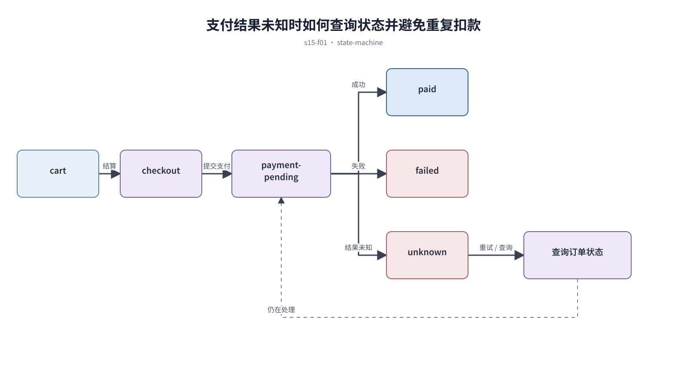

## 前置知识与学习目标

**前置知识：** 理解表单状态、身份验证、风险确认和错误恢复。

**本篇唯一核心问题：** 怎样在商品、结账、支付和失败恢复之间减少不确定性与中断？

读完后，你应该能够：能画出转化链路，识别每一步的用户疑问、承诺与恢复入口。本篇沿用“跨端客户工单管理 SaaS”，核心对象统一为 `ticket`、`customer`、`assignee`、`status`、`priority` 与 `permission`。

上一章已经解决“怎样在登录、注册、权限不足和账号恢复之间平衡安全与任务连续性”的问题；本篇把它作为输入，不再重复完整解释。

## 从真实问题出发

用户完成地址和优惠信息后支付失败，返回购物车时所有选择被重置。

先不要急着选择组件或颜色。应先写清楚当前用户、对象、触发条件、成功结果和失败后仍需保留的上下文，再判断界面应该表达什么。

## 核心机制

转化不是减少页面数量，而是持续降低不确定性。商品阶段解释价值与条件，结账阶段确认费用与信息，支付阶段防止重复提交，结果阶段提供订单状态和恢复方式。

<!-- series-figure:s15-f01 -->



<!-- series-figure:end -->

### 1. 总价、运费、税费和优惠在确认前完整可见

总价、运费、税费和优惠在确认前完整可见。它先固定主路径和优先级，后续布局不得反过来改变业务判断。验收时要用真实任务观察用户能否找到下一步。

### 2. 支付请求使用幂等标识，提交后禁用重复操作但提供明确进度

支付请求使用幂等标识，提交后禁用重复操作但提供明确进度。它把抽象原则转换成可见结构。验收时应检查对象、标签、状态和操作是否逐项对应，而不是凭整体观感打分。

### 3. 失败区分可重试、需换方式和订单已创建待确认

失败区分可重试、需换方式和订单已创建待确认。它负责异常与边界，必须使用空数据、慢请求、权限差异或冲突数据复测，不能只验证理想状态。

### 4. 返回修改时保留仍然有效的地址、购物车和优惠选择

返回修改时保留仍然有效的地址、购物车和优惠选择。它防止局部页面自行发明规则。跨端、跨主题或跨角色检查时，语义保持一致，呈现方式才允许重组。

## 关键角色、数据与状态

| 项目     | 在本篇中的含义                                                                       |
| -------- | ------------------------------------------------------------------------------------ | ------ | ------- |
| 输入     | cart → checkout → payment-pending → paid                                             | failed | unknown |
| 业务对象 | `ticket` 是工单，`customer` 是客户，`assignee` 是当前负责人                          |
| 约束     | `permission` 决定可执行动作；`priority` 影响排序，不直接替代业务状态                 |
| 状态主线 | `draft → submitted → processing → resolved → closed`，只有满足权限和前置条件才能转换 |
| 输出     | 能画出转化链路，识别每一步的用户疑问、承诺与恢复入口。                               |

cart → checkout → payment-pending → paid|failed|unknown；unknown 必须查询订单状态，不能直接再次扣款。

## 最小实践：贯穿工单案例

支付超时后页面显示“正在确认订单”，轮询订单状态；确认失败才允许更换支付方式，且保留地址和发票信息。

执行时使用下面的决策记录，避免示例只有结果而没有中间状态：

```text
输入：角色、ticket、当前 status、permission、终端与网络状态
检查：核心任务、业务规则、可见反馈、失败恢复、跨端差异
中间状态：记录用户动作、系统判断、状态变化和仍被保留的数据
输出：可验证的界面方案、实现约束与验收证据
失败边界：权限不足、空数据、超时、冲突、长文案和窄屏
```

这里的 `status` 表示业务状态；请求的 loading/error 是界面请求状态，两者不能混为一个字段。示例中的数值与规则只用于教学，接入真实项目时必须由产品规则、接口契约和数据字典确认。

## 常见误区

- **直到最后一步才展示额外费用：** 这会让界面结论失去可验证依据；应回到输入、状态和恢复路径重新检查。
- **超时后直接让用户再次支付：** 这会让界面结论失去可验证依据；应回到输入、状态和恢复路径重新检查。
- **用倒计时和虚假稀缺制造压力：** 这会让界面结论失去可验证依据；应回到输入、状态和恢复路径重新检查。

## 适用边界与不适用场景

- 具体支付流程必须遵守支付机构和当地法规。
- 订阅、预授权和实物电商的扣费与取消语义不同，不应共用一套文案。

如果当前任务没有多对象关系、状态变化或失败恢复，不要为了套用本章而制造额外组件和流程。复杂度必须来自真实认知问题。

## 自检题

1. 用一句话说明：怎样在商品、结账、支付和失败恢复之间减少不确定性与中断？
2. 在工单案例中，输入、中间状态和输出分别是什么？
3. 本章方法在哪些场景不应直接套用？

<details>
<summary>查看答案</summary>

1. 转化不是减少页面数量，而是持续降低不确定性。商品阶段解释价值与条件，结账阶段确认费用与信息，支付阶段防止重复提交，结果阶段提供订单状态和恢复方式。
2. cart → checkout → payment-pending → paid|failed|unknown；unknown 必须查询订单状态，不能直接再次扣款。
3. 具体支付流程必须遵守支付机构和当地法规。订阅、预授权和实物电商的扣费与取消语义不同，不应共用一套文案。

</details>

## 本篇总结

能画出转化链路，识别每一步的用户疑问、承诺与恢复入口。真正的完成标准不是“看起来合理”，而是每条规则都能追溯到任务、数据、状态或规范，并能通过边界场景验证。

## 下一篇衔接

下一篇将解决“怎样让内容型网站同时支持连续阅读、信息发现和克制转化”。本篇输出的决策、约束和案例状态将作为它的直接输入。

## 资料来源

- [Baymard：Checkout Usability](https://baymard.com/research/checkout-usability)
- [Stripe：Idempotent requests](https://docs.stripe.com/api/idempotent_requests)
- [WCAG 2.2：Error Prevention](https://www.w3.org/WAI/WCAG22/Understanding/error-prevention-legal-financial-data.html)
