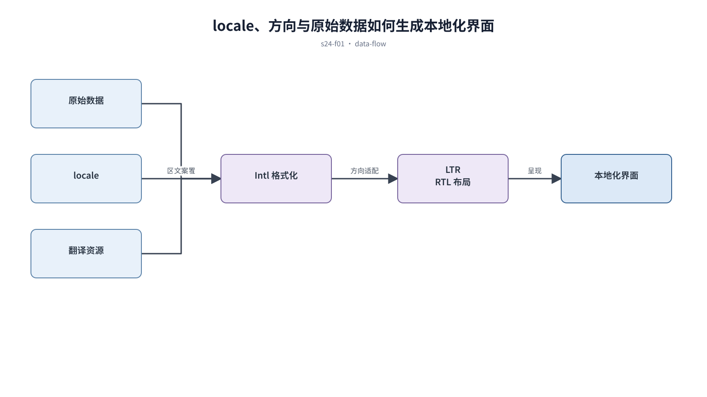

## 前置知识与学习目标

**前置知识：** 理解响应式、组件 token、表单和内容结构。

**本篇唯一核心问题：** 怎样让布局、文案和数据格式真正支持本地化与 RTL？

读完后，你应该能够：能把语言、方向、格式化和资源加载作为系统能力，而不是发布前替换文字。本篇沿用“跨端客户工单管理 SaaS”，核心对象统一为 `ticket`、`customer`、`assignee`、`status`、`priority` 与 `permission`。

上一章已经解决“怎样用语义 token 重建暗色层级，而不是把亮色页面反相”的问题；本篇把它作为输入，不再重复完整解释。

## 从真实问题出发

英文按钮翻译为德文后溢出，阿拉伯语只翻转文字却没有镜像导航和方向性图标。

先不要急着选择组件或颜色。应先写清楚当前用户、对象、触发条件、成功结果和失败后仍需保留的上下文，再判断界面应该表达什么。

## 核心机制

国际化提供语言与区域能力，本地化把具体内容适配目标市场。布局应容纳长度变化，方向使用逻辑属性，日期、数字和货币交给 locale-aware API。

<!-- series-figure:s24-f01 -->



<!-- series-figure:end -->

### 1. 文案使用资源键和完整语句，避免拼接片段

文案使用资源键和完整语句，避免拼接片段。它先固定主路径和优先级，后续布局不得反过来改变业务判断。验收时要用真实任务观察用户能否找到下一步。

### 2. 布局采用 inline/block 逻辑属性，明确哪些方向性图标需要镜像

布局采用 inline/block 逻辑属性，明确哪些方向性图标需要镜像。它把抽象原则转换成可见结构。验收时应检查对象、标签、状态和操作是否逐项对应，而不是凭整体观感打分。

### 3. 日期、数字、货币和复数使用 `Intl`，显示值与存储值分离

日期、数字、货币和复数使用 `Intl`，显示值与存储值分离。它负责异常与边界，必须使用空数据、慢请求、权限差异或冲突数据复测，不能只验证理想状态。

### 4. 测试长文案、混合方向、缺失翻译、字体回退和输入法

测试长文案、混合方向、缺失翻译、字体回退和输入法。它防止局部页面自行发明规则。跨端、跨主题或跨角色检查时，语义保持一致，呈现方式才允许重组。

## 关键角色、数据与状态

| 项目     | 在本篇中的含义                                                                       |
| -------- | ------------------------------------------------------------------------------------ |
| 输入     | 输入是 locale、方向和原始数据                                                        |
| 业务对象 | `ticket` 是工单，`customer` 是客户，`assignee` 是当前负责人                          |
| 约束     | `permission` 决定可执行动作；`priority` 影响排序，不直接替代业务状态                 |
| 状态主线 | `draft → submitted → processing → resolved → closed`，只有满足权限和前置条件才能转换 |
| 输出     | 是语义不变、格式符合地区习惯的界面。                                                 |

输入是 locale、方向和原始数据；中间状态是翻译资源与格式化；输出是语义不变、格式符合地区习惯的界面。

## 最小实践：贯穿工单案例

`ticket.createdAt` 存储 ISO 时间，按用户 locale 显示；SLA 数值与单位通过格式化生成，RTL 下侧栏和前进箭头按语义镜像。

执行时使用下面的决策记录，避免示例只有结果而没有中间状态：

```text
输入：角色、ticket、当前 status、permission、终端与网络状态
检查：核心任务、业务规则、可见反馈、失败恢复、跨端差异
中间状态：记录用户动作、系统判断、状态变化和仍被保留的数据
输出：可验证的界面方案、实现约束与验收证据
失败边界：权限不足、空数据、超时、冲突、长文案和窄屏
```

这里的 `status` 表示业务状态；请求的 loading/error 是界面请求状态，两者不能混为一个字段。示例中的数值与规则只用于教学，接入真实项目时必须由产品规则、接口契约和数据字典确认。

## 常见误区

- **在代码里拼接翻译片段：** 这会让界面结论失去可验证依据；应回到输入、状态和恢复路径重新检查。
- **把 RTL 当作全页面 CSS scaleX：** 这会让界面结论失去可验证依据；应回到输入、状态和恢复路径重新检查。
- **货币只替换符号不改变格式：** 这会让界面结论失去可验证依据；应回到输入、状态和恢复路径重新检查。

## 适用边界与不适用场景

- 法律、支付和文化敏感内容需要目标市场专家审核。
- 机器翻译可用于草稿，不应直接发布高风险界面文案。

如果当前任务没有多对象关系、状态变化或失败恢复，不要为了套用本章而制造额外组件和流程。复杂度必须来自真实认知问题。

## 自检题

1. 用一句话说明：怎样让布局、文案和数据格式真正支持本地化与 RTL？
2. 在工单案例中，输入、中间状态和输出分别是什么？
3. 本章方法在哪些场景不应直接套用？

<details>
<summary>查看答案</summary>

1. 国际化提供语言与区域能力，本地化把具体内容适配目标市场。布局应容纳长度变化，方向使用逻辑属性，日期、数字和货币交给 locale-aware API。
2. 输入是 locale、方向和原始数据；中间状态是翻译资源与格式化；输出是语义不变、格式符合地区习惯的界面。
3. 法律、支付和文化敏感内容需要目标市场专家审核。机器翻译可用于草稿，不应直接发布高风险界面文案。

</details>

## 本篇总结

能把语言、方向、格式化和资源加载作为系统能力，而不是发布前替换文字。真正的完成标准不是“看起来合理”，而是每条规则都能追溯到任务、数据、状态或规范，并能通过边界场景验证。

## 下一篇衔接

下一篇将解决“怎样把 token、组件 API、页面模式和质量门接入前端工程”。本篇输出的决策、约束和案例状态将作为它的直接输入。

## 资料来源

- [W3C Internationalization：Language and direction](https://www.w3.org/International/questions/qa-html-language-declarations)
- [W3C：Structural markup and right-to-left text](https://www.w3.org/International/questions/qa-html-dir)
- [MDN：Intl](https://developer.mozilla.org/en-US/docs/Web/JavaScript/Reference/Global_Objects/Intl)
