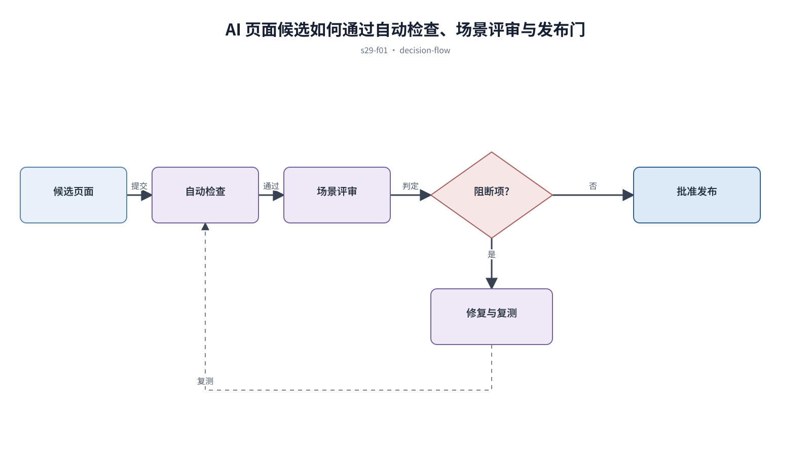

## 前置知识与学习目标

**前置知识：** 已完成设计系统、AI 提示词和从参考到代码的实现链路。

**本篇唯一核心问题：** 怎样用证据判断 AI 或低代码生成页面是否达到上线质量？

读完后，你应该能够：能按业务、状态、响应式、可访问性、性能和可维护性建立发布门。本篇沿用“跨端客户工单管理 SaaS”，核心对象统一为 `ticket`、`customer`、`assignee`、`status`、`priority` 与 `permission`。

上一章已经解决“怎样从参考图和流程证据提取约束，再安全落地为可维护代码”的问题；本篇把它作为输入，不再重复完整解释。

## 从真实问题出发

页面截图看起来完整，但真实数据一长就溢出，权限失败时还会暴露操作入口。

先不要急着选择组件或颜色。应先写清楚当前用户、对象、触发条件、成功结果和失败后仍需保留的上下文，再判断界面应该表达什么。

## 核心机制

质量评审以关键任务能否在边界条件下完成为中心。视觉一致性只是其中一层，还要验证数据、权限、状态、键盘、窄屏、弱网和代码约束。

<!-- series-figure:s29-f01 -->



<!-- series-figure:end -->

### 1. 先定义阻断发布的问题，再区分严重、一般和建议改进

先定义阻断发布的问题，再区分严重、一般和建议改进。它先固定主路径和优先级，后续布局不得反过来改变业务判断。验收时要用真实任务观察用户能否找到下一步。

### 2. 用真实边界数据和角色矩阵执行任务，不只看静态截图

用真实边界数据和角色矩阵执行任务，不只看静态截图。它把抽象原则转换成可见结构。验收时应检查对象、标签、状态和操作是否逐项对应，而不是凭整体观感打分。

### 3. 核对组件与 token 来源，禁止未说明的硬编码和废弃 API

核对组件与 token 来源，禁止未说明的硬编码和废弃 API。它负责异常与边界，必须使用空数据、慢请求、权限差异或冲突数据复测，不能只验证理想状态。

### 4. 每个缺陷记录复现步骤、影响、证据、责任人和复测结果

每个缺陷记录复现步骤、影响、证据、责任人和复测结果。它防止局部页面自行发明规则。跨端、跨主题或跨角色检查时，语义保持一致，呈现方式才允许重组。

## 关键角色、数据与状态

| 项目     | 在本篇中的含义                                                                       |
| -------- | ------------------------------------------------------------------------------------ | ----------------------- | -------- |
| 输入     | candidate → automated checks → scenario review → blocked                             | approved-with-follow-up | approved |
| 业务对象 | `ticket` 是工单，`customer` 是客户，`assignee` 是当前负责人                          |
| 约束     | `permission` 决定可执行动作；`priority` 影响排序，不直接替代业务状态                 |
| 状态主线 | `draft → submitted → processing → resolved → closed`，只有满足权限和前置条件才能转换 |
| 输出     | 能按业务、状态、响应式、可访问性、性能和可维护性建立发布门。                         |

candidate → automated checks → scenario review → blocked|approved-with-follow-up|approved；阻断项未关闭不得改分放行。

## 最小实践：贯穿工单案例

使用空数据、100 字标题、慢请求、无权限账号和键盘完成工单分派；任何数据泄露、不可恢复提交或核心任务中断均阻断上线。

执行时使用下面的决策记录，避免示例只有结果而没有中间状态：

```text
输入：角色、ticket、当前 status、permission、终端与网络状态
检查：核心任务、业务规则、可见反馈、失败恢复、跨端差异
中间状态：记录用户动作、系统判断、状态变化和仍被保留的数据
输出：可验证的界面方案、实现约束与验收证据
失败边界：权限不足、空数据、超时、冲突、长文案和窄屏
```

这里的 `status` 表示业务状态；请求的 loading/error 是界面请求状态，两者不能混为一个字段。示例中的数值与规则只用于教学，接入真实项目时必须由产品规则、接口契约和数据字典确认。

## 常见误区

- **只按视觉相似度评分：** 这会让界面结论失去可验证依据；应回到输入、状态和恢复路径重新检查。
- **发现问题后只修改分数：** 这会让界面结论失去可验证依据；应回到输入、状态和恢复路径重新检查。
- **把范围外既有错误伪装成本次通过或失败：** 这会让界面结论失去可验证依据；应回到输入、状态和恢复路径重新检查。

## 适用边界与不适用场景

- 内部演示可以降低发布门，但必须明确不可用于生产。
- 自动检查不能替代业务专家、无障碍和安全场景验证。

如果当前任务没有多对象关系、状态变化或失败恢复，不要为了套用本章而制造额外组件和流程。复杂度必须来自真实认知问题。

## 自检题

1. 用一句话说明：怎样用证据判断 AI 或低代码生成页面是否达到上线质量？
2. 在工单案例中，输入、中间状态和输出分别是什么？
3. 本章方法在哪些场景不应直接套用？

<details>
<summary>查看答案</summary>

1. 质量评审以关键任务能否在边界条件下完成为中心。视觉一致性只是其中一层，还要验证数据、权限、状态、键盘、窄屏、弱网和代码约束。
2. candidate → automated checks → scenario review → blocked|approved-with-follow-up|approved；阻断项未关闭不得改分放行。
3. 内部演示可以降低发布门，但必须明确不可用于生产。自动检查不能替代业务专家、无障碍和安全场景验证。

</details>

## 本篇总结

能按业务、状态、响应式、可访问性、性能和可维护性建立发布门。真正的完成标准不是“看起来合理”，而是每条规则都能追溯到任务、数据、状态或规范，并能通过边界场景验证。

## 下一篇衔接

下一篇将解决“怎样在 30 天内用一个连续项目建立可解释、可实现、可验收的页面设计能力”。本篇输出的决策、约束和案例状态将作为它的直接输入。

## 资料来源

- [WCAG 2.2 Quick Reference](https://www.w3.org/WAI/WCAG22/quickref/)
- [OWASP ASVS](https://owasp.org/www-project-application-security-verification-standard/)
- [Storybook：Testing](https://storybook.js.org/docs/writing-tests)
