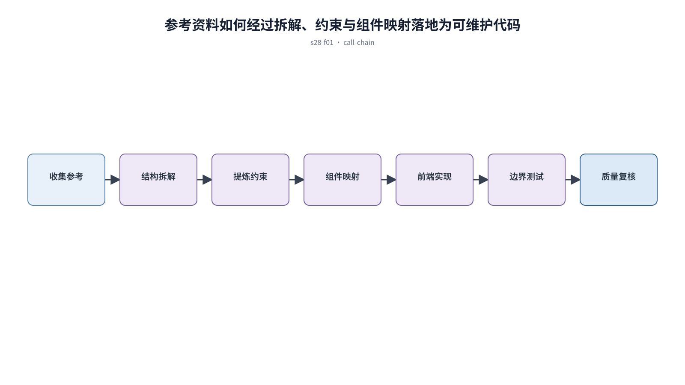

## 前置知识与学习目标

**前置知识：** 理解研究证据、Design Tokens、组件工程和结构化提示词。

**本篇唯一核心问题：** 怎样从参考图和流程证据提取约束，再安全落地为可维护代码？

读完后，你应该能够：能执行参考收集、结构拆解、约束映射、实现与复核的完整链路。本篇沿用“跨端客户工单管理 SaaS”，核心对象统一为 `ticket`、`customer`、`assignee`、`status`、`priority` 与 `permission`。

上一章已经解决“怎样把页面设计请求写成包含输入、约束、状态和验收的可执行提示词”的问题；本篇把它作为输入，不再重复完整解释。

## 从真实问题出发

开发者把参考截图直接交给 AI 仿写，结果像截图但组件、响应式和状态无法维护。

先不要急着选择组件或颜色。应先写清楚当前用户、对象、触发条件、成功结果和失败后仍需保留的上下文，再判断界面应该表达什么。

## 核心机制

参考图是证据，不是规格。先标记来源与意图，再拆解内容层级、组件、状态和跨端行为；随后映射到现有 token 与组件，实施后以任务和边界数据验收。

<!-- series-figure:s28-f01 -->



<!-- series-figure:end -->

### 1. 参考资料按信息架构、交互模式和视觉语言分开提取

参考资料按信息架构、交互模式和视觉语言分开提取。它先固定主路径和优先级，后续布局不得反过来改变业务判断。验收时要用真实任务观察用户能否找到下一步。

### 2. 复制之前说明要解决的问题，并排除品牌专属与偶然细节

复制之前说明要解决的问题，并排除品牌专属与偶然细节。它把抽象原则转换成可见结构。验收时应检查对象、标签、状态和操作是否逐项对应，而不是凭整体观感打分。

### 3. 形成组件映射表：参考元素、现有组件、差距和处理方式

形成组件映射表：参考元素、现有组件、差距和处理方式。它负责异常与边界，必须使用空数据、慢请求、权限差异或冲突数据复测，不能只验证理想状态。

### 4. 实现顺序为语义结构、状态、响应式、视觉细节和质量复核

实现顺序为语义结构、状态、响应式、视觉细节和质量复核。它防止局部页面自行发明规则。跨端、跨主题或跨角色检查时，语义保持一致，呈现方式才允许重组。

## 关键角色、数据与状态

| 项目     | 在本篇中的含义                                                                       |
| -------- | ------------------------------------------------------------------------------------ |
| 输入     | collect → decompose → constrain → map → implement → verify                           |
| 业务对象 | `ticket` 是工单，`customer` 是客户，`assignee` 是当前负责人                          |
| 约束     | `permission` 决定可执行动作；`priority` 影响排序，不直接替代业务状态                 |
| 状态主线 | `draft → submitted → processing → resolved → closed`，只有满足权限和前置条件才能转换 |
| 输出     | 能执行参考收集、结构拆解、约束映射、实现与复核的完整链路。                           |

collect → decompose → constrain → map → implement → verify；复核失败回到对应约束，不整页重生。

## 最小实践：贯穿工单案例

从三个工单产品提炼“固定筛选 + 摘要列 + 详情抽屉”模式，映射到现有 `FilterBar`、`DataTable`、`Drawer`，再测试长标题、空数据和窄容器。

执行时使用下面的决策记录，避免示例只有结果而没有中间状态：

```text
输入：角色、ticket、当前 status、permission、终端与网络状态
检查：核心任务、业务规则、可见反馈、失败恢复、跨端差异
中间状态：记录用户动作、系统判断、状态变化和仍被保留的数据
输出：可验证的界面方案、实现约束与验收证据
失败边界：权限不足、空数据、超时、冲突、长文案和窄屏
```

这里的 `status` 表示业务状态；请求的 loading/error 是界面请求状态，两者不能混为一个字段。示例中的数值与规则只用于教学，接入真实项目时必须由产品规则、接口契约和数据字典确认。

## 常见误区

- **把单张截图当作完整需求：** 这会让界面结论失去可验证依据；应回到输入、状态和恢复路径重新检查。
- **忽略不可见的加载和错误状态：** 这会让界面结论失去可验证依据；应回到输入、状态和恢复路径重新检查。
- **AI 输出新组件而不映射现有系统：** 这会让界面结论失去可验证依据；应回到输入、状态和恢复路径重新检查。

## 适用边界与不适用场景

- 受版权、商标或保密约束的素材不得直接复制。
- 只有静态图时无法推断真实交互，应把未知行为记录为假设。

如果当前任务没有多对象关系、状态变化或失败恢复，不要为了套用本章而制造额外组件和流程。复杂度必须来自真实认知问题。

## 自检题

1. 用一句话说明：怎样从参考图和流程证据提取约束，再安全落地为可维护代码？
2. 在工单案例中，输入、中间状态和输出分别是什么？
3. 本章方法在哪些场景不应直接套用？

<details>
<summary>查看答案</summary>

1. 参考图是证据，不是规格。先标记来源与意图，再拆解内容层级、组件、状态和跨端行为；随后映射到现有 token 与组件，实施后以任务和边界数据验收。
2. collect → decompose → constrain → map → implement → verify；复核失败回到对应约束，不整页重生。
3. 受版权、商标或保密约束的素材不得直接复制。只有静态图时无法推断真实交互，应把未知行为记录为假设。

</details>

## 本篇总结

能执行参考收集、结构拆解、约束映射、实现与复核的完整链路。真正的完成标准不是“看起来合理”，而是每条规则都能追溯到任务、数据、状态或规范，并能通过边界场景验证。

## 下一篇衔接

下一篇将解决“怎样用证据判断 AI 或低代码生成页面是否达到上线质量”。本篇输出的决策、约束和案例状态将作为它的直接输入。

## 资料来源

- [Figma：Guide to Dev Mode](https://help.figma.com/hc/en-us/articles/15023124644247-Guide-to-Dev-Mode)
- [WAI：Page Structure](https://www.w3.org/WAI/tutorials/page-structure/)
- [MDN：Responsive design](https://developer.mozilla.org/en-US/docs/Learn_web_development/Core/CSS_layout/Responsive_Design)
