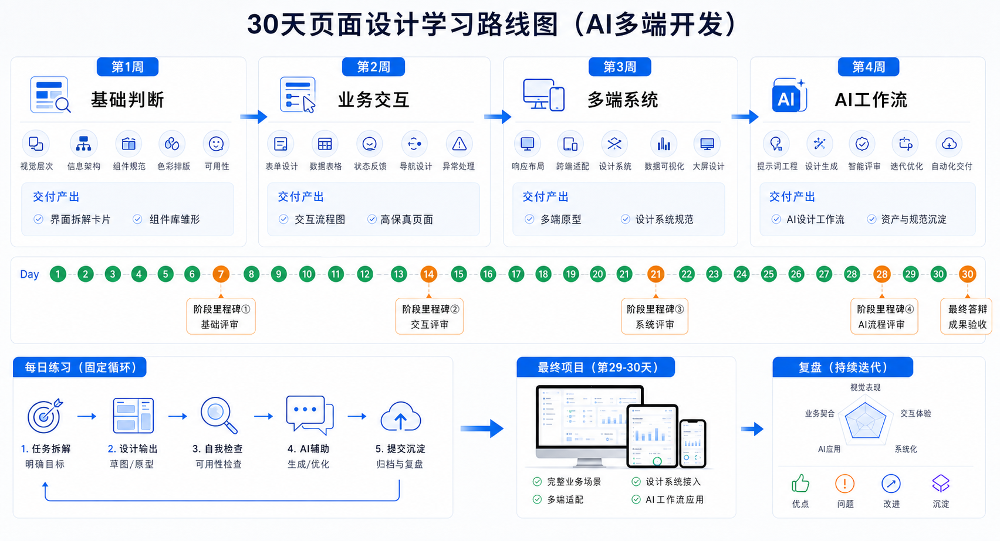

## 核心结论

开发者学习页面设计，不需要从艺术训练开始，而应该从业务界面判断力开始。你需要知道什么是好信息层级、什么是好交互、什么状态不能漏、AI 提示词怎么写。

30 天足够建立一套可执行的设计方法。



## 第 1 周：基础判断力

第 1-2 天学习信息层级、视觉节奏和高级感来源。第 3-4 天学习字体、字号、行高、间距。第 5 天学习颜色系统。第 6-7 天拆解 5 个你喜欢的产品页面。

目标是能说清楚一个页面为什么好，为什么乱。

## 第 2 周：业务交互

学习表单、筛选、搜索、弹窗、表格、详情页、状态设计。用一个后台对象做练习，比如订单、用户、工单或合同。

目标是能设计一个完整列表页和详情页。

## 第 3 周：多端和系统化

学习 Web、H5、App、大屏差异，响应式布局、可访问性、暗色模式和 Design Tokens。

目标是把同一个业务重组为多端方案，而不是简单缩放。

## 第 4 周：AI 工作流

建立提示词模板、组件约束、页面模式库和评审清单。用 AI 生成页面，再按检查表修改。

目标是让 AI 成为稳定的设计和开发搭档，而不是随机页面生成器。

## 每日练习模板

```text
今天选择一个真实页面。
1. 写出用户任务。
2. 拆解信息层级。
3. 标出主操作和状态。
4. 设计桌面端和移动端。
5. 用 AI 生成方案。
6. 用检查表评审并修改。
```

## 最终项目

建议做一个完整小系统：登录、工作台、列表、详情、编辑、权限不足、移动端 H5 表单、大屏看板。这个项目能覆盖大多数真实业务页面。

## 检查清单

- 是否能独立评审页面问题？
- 是否有自己的提示词模板？
- 是否有设计令牌和组件约束？
- 是否完成至少一个多端实战页面？
- 是否能说明每个设计决策背后的业务理由？

## 参考来源

- Nielsen Norman Group：https://www.nngroup.com/
- Material Design 3：https://m3.material.io/
- Apple Human Interface Guidelines：https://developer.apple.com/design/human-interface-guidelines
- WCAG 2.2：https://www.w3.org/TR/WCAG22/

