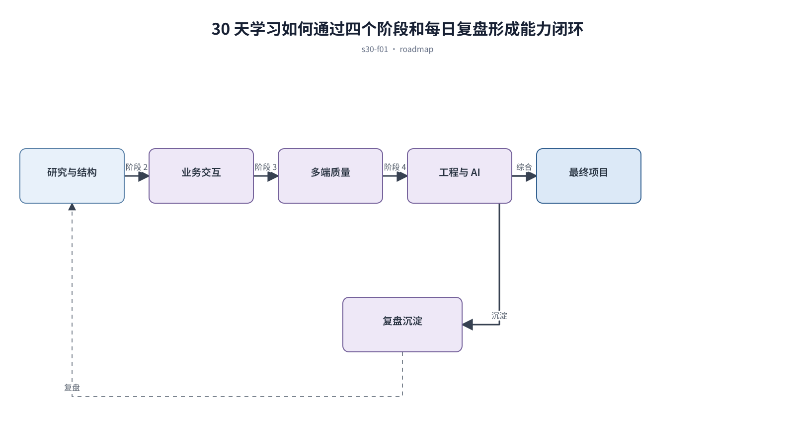

## 前置知识与学习目标

**前置知识：** 已完成本系列前 29 篇，或具备基本前端与业务分析能力。

**本篇唯一核心问题：** 怎样在 30 天内用一个连续项目建立可解释、可实现、可验收的页面设计能力？

读完后，你应该能够：把研究、结构、视觉、交互、多端、工程和 AI 工作流合并为可复盘的练习计划。本篇沿用“跨端客户工单管理 SaaS”，核心对象统一为 `ticket`、`customer`、`assignee`、`status`、`priority` 与 `permission`。

上一章已经解决“怎样用证据判断 AI 或低代码生成页面是否达到上线质量”的问题；本篇把它作为输入，不再重复完整解释。

## 从真实问题出发

学习者收藏大量设计文章，却没有连续项目、阶段产出和评审证据。

先不要急着选择组件或颜色。应先写清楚当前用户、对象、触发条件、成功结果和失败后仍需保留的上下文，再判断界面应该表达什么。

## 核心机制

学习路线以同一个工单 SaaS 递增复杂度：先解释判断，再设计任务，随后重组多端，最后工程化并让 AI 在约束内协作。每天必须留下产出、验收与下一步。

<!-- series-figure:s30-f01 -->



<!-- series-figure:end -->

### 1. 第 1 周完成研究证据、信息架构和视觉基础，不急于画完整高保真页面

第 1 周完成研究证据、信息架构和视觉基础，不急于画完整高保真页面。它先固定主路径和优先级，后续布局不得反过来改变业务判断。验收时要用真实任务观察用户能否找到下一步。

### 2. 第 2 周完成列表、详情、表单、状态、表格和工作台任务闭环

第 2 周完成列表、详情、表单、状态、表格和工作台任务闭环。它把抽象原则转换成可见结构。验收时应检查对象、标签、状态和操作是否逐项对应，而不是凭整体观感打分。

### 3. 第 3 周完成多端、响应式、可访问性、动效、暗色和国际化验证

第 3 周完成多端、响应式、可访问性、动效、暗色和国际化验证。它负责异常与边界，必须使用空数据、慢请求、权限差异或冲突数据复测，不能只验证理想状态。

### 4. 第 4 周完成 token、组件工程、AI 提示词、参考到代码和上线评审

第 4 周完成 token、组件工程、AI 提示词、参考到代码和上线评审。它防止局部页面自行发明规则。跨端、跨主题或跨角色检查时，语义保持一致，呈现方式才允许重组。

## 关键角色、数据与状态

| 项目     | 在本篇中的含义                                                                       |
| -------- | ------------------------------------------------------------------------------------ |
| 输入     | 每日循环为目标 → 产出 → 边界测试 → 证据记录 → 复盘                                   |
| 业务对象 | `ticket` 是工单，`customer` 是客户，`assignee` 是当前负责人                          |
| 约束     | `permission` 决定可执行动作；`priority` 影响排序，不直接替代业务状态                 |
| 状态主线 | `draft → submitted → processing → resolved → closed`，只有满足权限和前置条件才能转换 |
| 输出     | 把研究、结构、视觉、交互、多端、工程和 AI 工作流合并为可复盘的练习计划。             |

每日循环为目标 → 产出 → 边界测试 → 证据记录 → 复盘；每周里程碑只有通过验收才进入下一阶段。

## 最小实践：贯穿工单案例

最终交付登录、工作台、工单列表、详情、编辑、权限不足、H5 快速处理和大屏异常监控，并附 token、组件映射与验收报告。

执行时使用下面的决策记录，避免示例只有结果而没有中间状态：

```text
输入：角色、ticket、当前 status、permission、终端与网络状态
检查：核心任务、业务规则、可见反馈、失败恢复、跨端差异
中间状态：记录用户动作、系统判断、状态变化和仍被保留的数据
输出：可验证的界面方案、实现约束与验收证据
失败边界：权限不足、空数据、超时、冲突、长文案和窄屏
```

这里的 `status` 表示业务状态；请求的 loading/error 是界面请求状态，两者不能混为一个字段。示例中的数值与规则只用于教学，接入真实项目时必须由产品规则、接口契约和数据字典确认。

## 常见误区

- **每天更换练习产品：** 这会让界面结论失去可验证依据；应回到输入、状态和恢复路径重新检查。
- **只保存好看的截图不记录决策：** 这会让界面结论失去可验证依据；应回到输入、状态和恢复路径重新检查。
- **把 AI 首次输出当作最终成果：** 这会让界面结论失去可验证依据；应回到输入、状态和恢复路径重新检查。

## 适用边界与不适用场景

- 30 天用于建立方法和基本实践，不代表替代长期用户研究与工程经验。
- 学习者可调整每日投入，但不能跳过阶段产出与复盘。

如果当前任务没有多对象关系、状态变化或失败恢复，不要为了套用本章而制造额外组件和流程。复杂度必须来自真实认知问题。

## 自检题

1. 用一句话说明：怎样在 30 天内用一个连续项目建立可解释、可实现、可验收的页面设计能力？
2. 在工单案例中，输入、中间状态和输出分别是什么？
3. 本章方法在哪些场景不应直接套用？

<details>
<summary>查看答案</summary>

1. 学习路线以同一个工单 SaaS 递增复杂度：先解释判断，再设计任务，随后重组多端，最后工程化并让 AI 在约束内协作。每天必须留下产出、验收与下一步。
2. 每日循环为目标 → 产出 → 边界测试 → 证据记录 → 复盘；每周里程碑只有通过验收才进入下一阶段。
3. 30 天用于建立方法和基本实践，不代表替代长期用户研究与工程经验。学习者可调整每日投入，但不能跳过阶段产出与复盘。

</details>

## 本篇总结

把研究、结构、视觉、交互、多端、工程和 AI 工作流合并为可复盘的练习计划。真正的完成标准不是“看起来合理”，而是每条规则都能追溯到任务、数据、状态或规范，并能通过边界场景验证。

## 下一篇衔接

系列到这里完成闭环。请用最终项目重新执行研究、设计、实现和验收，并把失败证据带回相应章节迭代。

## 资料来源

- [GOV.UK Service Manual](https://www.gov.uk/service-manual)
- [WCAG 2.2](https://www.w3.org/TR/WCAG22/)
- [Design Tokens Community Group](https://www.designtokens.org/)
